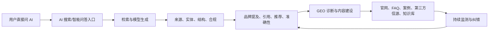

# GEO（生成式引擎优化）中国市场专家学习报告 {#top}
> 默认假设：中国市场，研究时间截至 2026-06-03，未来 3 年为主要观察窗口；用途是帮助新人、营销团队、内容团队、产品团队和管理层快速建立 GEO 领域认知；输出深度为 standard。GEO 在中国还不是官方统计行业，本报告把它作为“AI 搜索与生成式问答场景下的品牌可见性、内容证据和答案影响力优化服务”来分析。

## 导读摘要 {#section-01}
### 这份学习材料解决什么问题 {#section-02}
GEO 这个词看起来像 SEO 的新名字，但真正的变化不是把搜索结果从 10 个蓝色链接换成一段 AI 回答，而是用户获取信息的方式正在变成“直接问、直接比较、直接让 AI 推荐”。对品牌和企业来说，问题也就从“网页能不能排上去”变成了“AI 在回答用户问题时，会不会理解我、引用我、推荐我，还是把我说错、漏掉，甚至推荐了竞争对手”。

这份报告面向第一次系统接触 GEO 的读者。读完以后，你应该能用普通话解释 GEO 和 SEO 的差别，能说清中国市场里哪些平台和内容源会影响 AI 答案，能判断一个企业为什么需要做 GEO，也能识别哪些服务是真正的 GEO，哪些只是把传统内容代写换了一个名字。

### 本报告的三个亮点 {#section-03}
1. 它先讲边界，再讲结构，避免把 GEO、SEO、AEO、AI 投放、内容营销和舆情监测混在一起。
2. 它把关键词做成教学卡，每个概念都给出通俗理解、底层逻辑、真实例子、应用场景和常见误区。
3. 它最后用费曼问题做自测，帮助读者判断自己是真的理解了 GEO，还是只记住了几个热词。

### 推荐阅读路径 {#section-04}
如果你完全陌生，建议先读“默认假设与研究边界”“一页专家速览”和“领域定义”，先把 GEO 的对象和边界放清楚。如果你要做业务判断，重点看“价值链、参与者与利润池”“竞争结构”和“机会、风险与验证清单”。如果你要带团队学习，可以直接使用“关键词库”“专家学习教程”和“费曼自测”作为内部培训材料。

### 底层逻辑说明 {#section-05}
本报告按“边界 -> 结构 -> 动态 -> 例子 -> 自测”的顺序展开。先定边界，是为了避免把所有 AI 营销都叫 GEO；再看分类和价值链，是为了知道谁在创造价值、谁在买单；接着看政策、平台、技术和竞争，是为了理解中国市场为什么和海外不同；最后用关键词、案例和问题把知识变成可复述、可操作、可验证的能力。

## 0. 默认假设与研究边界 {#section-06}
先把口径说清楚。GEO 在公开市场里还没有统一的官方分类，也没有被 CNNIC、统计局或广告监管体系单独列为一个行业。因此，本报告不把“GEO 市场规模”写成确定数字，而是从搜索用户、生成式 AI 使用、智能搜索产品、内容服务和监测工具几个相邻口径来判断它的发展阶段。

| 项目 | 当前设定 | 说明 |
|---|---|---|
| 主题 | GEO，Generative Engine Optimization，生成式引擎优化 | 也常被叫做 AI 搜索优化、答案引擎优化、LLMO、AI visibility |
| 地域 | 中国市场 | 包括百度、夸克、腾讯元宝、豆包、Kimi、通义、DeepSeek 等中文 AI 问答和搜索场景 |
| 用途 | 建立领域专家认知 | 适合营销、内容、品牌、公关、产品、销售、创业和管理层学习 |
| 时间范围 | 当前到未来 3 年 | 重点看 2026-2028 年平台、监管、商业化和企业采购变化 |
| 深度 | standard | 50 个关键词教学卡，10 个费曼问题 |
| 排除项 | 不做单一品牌投放方案，不承诺排名，不给未经验证的市场规模 | GEO 目前更适合做“可见性和证据质量提升”，不适合承诺固定排名 |

## 1. 一页专家速览 {#section-07}
这一节先给整份报告的压缩版。你可以把 GEO 理解成“让企业信息更容易被 AI 找到、理解、引用和正确推荐”的一套方法。它不是简单多发文章，也不是让模型听话，而是把企业的事实、证据、页面、外部信源和监测机制做成 AI 更容易处理的结构。

### 一句话定义 {#section-08}
GEO 是面向 AI 搜索、智能问答和生成式推荐场景的优化方法，目标是提升品牌、产品和事实在 AI 答案中的可见性、可引用性、准确性和推荐概率。

### 五个核心事实 {#section-09}
1. fact：中国搜索引擎用户仍然巨大。CNNIC 第57次报告显示，2025 年 12 月中国搜索引擎用户规模约 7.82 亿，使用率约 69.5%。
2. fact：中国生成式 AI 用户已经形成大众规模。CNNIC 生成式人工智能应用发展报告显示，截至 2025 年 6 月，中国生成式人工智能用户规模达 5.15 亿，较 2024 年 12 月增长 2.66 亿，普及率 36.5%。
3. fact：生成式 AI 服务在中国受到备案和内容安全监管约束。国家网信办持续发布生成式人工智能服务已备案信息，企业侧不能把 GEO 简化为操控答案。
4. fact：GEO 的学术来源来自 2023 年的 Generative Engine Optimization 论文，论文把目标定义为提升内容在生成式引擎回答中的可见性。
5. inference：中国 GEO 的需求会先从品牌、公关、B2B 销售、教育咨询、医疗健康、金融服务、本地服务和高客单价行业出现，因为这些场景里“AI 怎么描述我”会直接影响信任和线索。

### 五个关键判断 {#section-10}
| 判断 | 类型 | 证据 | 置信度 |
|---|---|---|---|
| GEO 在中国是早期成长市场，不是成熟行业 | inference | 生成式 AI 用户增长快，但 GEO 缺少官方统计口径 | medium |
| 中国 GEO 的核心不是单平台排名，而是多平台答案一致性 | inference | 中文用户会在搜索引擎、AI 助手、微信生态和内容社区之间切换 | high |
| 企业官网仍然重要，但单靠官网不够 | inference | AI 答案会综合官方页面、第三方媒体、社区内容、百科、问答和结构化资料 | high |
| 合规会成为中国 GEO 的硬边界 | fact / inference | 生成式 AI 服务管理办法和备案制度要求内容真实、合法、安全 | high |
| GEO 监测比内容生产更容易成为长期付费项 | hypothesis | 企业会持续关心品牌是否被提及、引用、说错和推荐 | medium |

## 2. 领域定义、边界与排除项 {#section-11}
理解 GEO，先不要问“怎么让 AI 推荐我”，而要问“AI 为什么会在回答里使用某些信息”。生成式答案通常来自检索、已有模型知识、平台数据、用户上下文和安全规则的共同作用。GEO 能影响的是可公开验证的内容、实体关系、信源质量、结构化表达和持续监测，不能保证模型在任何问题下都按企业期望回答。

| 口径 | 定义 | 包含 | 排除 |
|---|---|---|---|
| 宽口径 | 所有影响 AI 答案中品牌可见性的活动 | 内容、官网、百科、媒体、社区、知识库、监测、纠错、公关 | 纯广告投放、纯舆情删帖、黑帽操控 |
| 窄口径 | 面向生成式搜索和 AI 问答的内容与证据优化 | 问题库、实体库、事实卡、FAQ、对比页、引用源、监测 Prompt | 传统 SEO 单页排名服务 |
| 数据口径 | 可被监测和验证的 AI 答案表现 | 提及率、引用率、推荐率、准确率、竞品共现、来源分布 | 未公开模型内部权重 |
| 排除口径 | 容易混淆但不是 GEO 本身的对象 | SEO、SEM、AEO、内容营销、知识库建设、PR | 把所有 AI 营销都叫 GEO |

## 3. 多口径分类地图 {#section-12}
同一个 GEO 问题，在不同团队眼里会变成不同分类。品牌团队关心“AI 怎么评价我”，销售团队关心“用户问推荐时有没有我”，内容团队关心“哪些页面容易被引用”，技术团队关心“爬取、结构化和知识库”，管理层关心“这是不是新的获客入口”。这些口径都对，但不能混着用。

| 分类视角 | 用途 | 典型问题 | 代表来源/依据 |
|---|---|---|---|
| 平台口径 | 判断在哪些 AI 场景优化 | 百度 AI 搜索、夸克、腾讯元宝、豆包、Kimi、通义、DeepSeek 哪些要测 | 平台公开产品与用户实际问答 |
| 意图口径 | 判断用户会怎么问 | 推荐、比较、价格、风险、替代、教程、品牌验证、场景解决方案 | 监测 Prompt 库和搜索词扩展 |
| 内容口径 | 判断要补什么材料 | 官网页面、FAQ、对比表、案例、白皮书、百科、媒体报道 | 内容结构和可引用性 |
| 信源口径 | 判断 AI 会信谁 | 官方站、权威媒体、百科、垂直社区、行业协会、公开报告 | 引用来源和答案来源追踪 |
| 技术口径 | 判断如何被抓取和抽取 | 爬虫可访问、结构化数据、页面层级、语义分块、实体关系 | 网站技术和信息架构 |
| 商业模式口径 | 判断服务怎么卖 | 诊断、内容建设、知识库、监测、咨询、年度运营 | 服务商产品包和企业预算 |

## 4. 价值链、参与者与利润池 {#section-13}
GEO 的价值链不像传统广告那样清楚，因为它同时跨过内容、技术、品牌、公关和数据监测。一个企业真正买单的，通常不是“写几篇文章”，而是“让 AI 在关键问题上更准确地理解我，并持续发现哪里说错了、漏掉了、被竞品压过了”。

| 环节/角色 | 核心能力 | 收入或价值来源 | 壁垒 | 观察指标 |
|---|---|---|---|---|
| 企业/品牌方 | 产品事实、客户案例、资质与官网 | 获客、品牌信任、销售辅助 | 真实资料和组织协同 | 品牌提及率、答案准确率、线索贡献 |
| GEO 咨询服务商 | 诊断、策略、内容结构、监测解释 | 项目费、年框费、顾问费 | 方法论、行业经验、客户关系 | 交付周期、续费率、问题覆盖 |
| 内容与 PR 团队 | 可引用内容、媒体露出、FAQ、案例 | 内容服务费、传播预算 | 权威信源和写作质量 | 引用率、外部信源数量 |
| 监测工具/SaaS | Prompt 库、答案采样、竞品对比、报表 | 订阅费、席位费、API 费 | 数据采集、稳定评估、报表能力 | 监测频次、平台覆盖、准确率 |
| 网站与技术团队 | 页面可抓取、结构化、知识库、Schema | 技术服务费、开发费 | 工程能力和系统集成 | 抓取成功率、页面索引、结构完整性 |
| AI 平台与搜索平台 | 入口、模型、检索、排序、安全规则 | 广告、会员、API、生态服务 | 用户流量、模型和数据 | 活跃用户、引用源规则、商业化入口 |

## 5. 当前状态八维诊断 {#section-14}
GEO 在中国的状态可以用一句话概括：需求正在被生成式 AI 使用习惯拉出来，但供给仍然混杂。很多企业已经意识到“AI 会不会推荐我”很重要，但市场上仍然有不少服务把传统 SEO、软文、公关稿和舆情监测包装成 GEO。

| 维度 | 当前状态 | 关键证据 | 不确定性 |
|---|---|---|---|
| 市场 | 早期成长 | 生成式 AI 用户快速增长，AI 搜索产品密集出现 | 没有 GEO 官方市场规模 |
| 需求 | 品牌、B2B、教育、医疗、金融、本地服务更敏感 | 这些行业依赖信任、推荐和复杂决策 | 不同行业采购预算差异大 |
| 供给 | 服务商、内容团队、SEO 团队、SaaS 工具混合进入 | 市场出现 GEO、AI 搜索优化、LLMO 等多种叫法 | 服务质量参差不齐 |
| 竞争 | 早期分散 | 方法论、监测能力和客户资源是主要差异 | 未来是否平台化仍不确定 |
| 价值链 | 监测和知识库可能更长期 | 一次性内容项目容易被替代，持续监测更接近经营需求 | 归因难度较高 |
| 政策/标准 | 合规是硬边界 | 生成式 AI 服务管理办法、备案信息、AI+ 政策 | GEO 具体服务尚无专门标准 |
| 技术 | RAG、搜索增强、Agent 和结构化数据影响大 | AI 答案依赖检索、抽取、排序、安全规则 | 平台算法不透明 |
| 资本/财务 | 尚未形成清晰上市赛道 | 更多以营销服务、SaaS、AI 工具子模块出现 | 市场规模和毛利模型待验证 |

## 6. 生命周期与变化变量 {#section-15}
GEO 本身处在早期成长阶段，但它依赖的几个基础层处于不同阶段。传统搜索已经成熟，生成式 AI 应用正在快速普及，AI 搜索产品还在试错，企业级 GEO 服务刚开始标准化。看生命周期时，要把这些层拆开，否则会误判。

| 细分领域 | 阶段判断 | 证据 | 例外/反例 | 未来变量 |
|---|---|---|---|---|
| 传统搜索 SEO | 成熟 | 搜索用户规模仍大，SEO 方法成熟 | AI 搜索改变用户入口 | 搜索结果页 AI 化程度 |
| AI 搜索/智能问答 | 成长 | 生成式 AI 用户快速增长，平台密集推出 AI 搜索体验 | 用户习惯和商业化仍在变化 | 平台引用规则、广告形态 |
| GEO 服务 | 导入到成长 | 企业开始采购诊断、内容、监测和知识库 | 官方口径和行业标准缺失 | 是否出现可复用评估标准 |
| GEO 监测工具 | 早期成长 | 品牌可见性、推荐率和引用率需要持续监测 | 采样波动和平台限制较强 | 多平台稳定采样能力 |
| 企业知识库/GEO 内容资产 | 成长 | 企业需要把事实结构化，供官网、销售和 AI 场景复用 | 内部资料治理成本高 | 知识库与 Agent 集成 |

## 7. 竞争结构、壁垒与替代风险 {#section-16}
GEO 的竞争不会只发生在 GEO 服务商之间。传统 SEO 公司、内容营销公司、公关公司、AI SaaS、建站公司、数据监测工具和平台生态伙伴都可能进入。真正的壁垒不只是会写内容，而是能把“用户怎么问、AI 怎么答、证据在哪里、企业怎么补、效果怎么测”连成闭环。

| 力量 | 当前判断 | 证据 | 对学习/行动的影响 |
|---|---|---|---|
| 现有竞争 | 分散且定义混乱 | 市场上多种叫法并存 | 要先看服务是否有监测和证据链 |
| 潜在进入者 | 很多 | SEO、PR、内容、SaaS、咨询都能切入 | 低端内容服务会价格战 |
| 替代品 | 强 | 企业可用自建内容团队、AI 工具、传统 PR 替代一部分 | 服务商要证明专业方法和持续效果 |
| 供应方 | 平台和信源强 | AI 平台规则不透明，权威媒体和内容社区影响答案 | 需要多平台和多信源策略 |
| 购买方 | 中大型企业议价能力强 | GEO 归因难，客户会要求可验证结果 | 报告和指标体系要清楚 |

## 8. 政策、标准、技术与资本信号 {#section-17}
中国 GEO 不能脱离监管和平台生态来理解。生成式 AI 服务要面对内容安全、备案、数据来源、版权、广告合规和消费者保护等问题。对企业来说，合规不是附属项，而是 GEO 能否长期做下去的前提。

| 信号类型 | 关键内容 | 为什么重要 | 跟踪方式 |
|---|---|---|---|
| 政策/监管 | 生成式人工智能服务管理暂行办法、备案公告、AI+ 行动意见 | 限定内容真实性、安全性和服务边界 | 国家网信办、国务院、行业监管动态 |
| 标准/认证 | AI 生成内容标识、算法备案、行业内容规范 | 影响平台可展示内容和企业责任 | 监管公告、平台规则、行业标准 |
| 技术路线 | RAG、混合搜索、Agent、知识图谱、多模态搜索 | 决定内容是否被检索、抽取和引用 | 平台产品更新、开发者文档 |
| 资本/并购 | AI 应用、营销科技、数据监测和企业知识库工具 | 可能推动 GEO 工具化和平台化 | 融资、并购、上市公司 AI 业务披露 |

## 9. 代表公司、人物、机构、案例或实践场景 {#section-18}
下面这些对象不是排名，也不是推荐。它们只是学习锚点，用来说明 GEO 在中国市场会碰到哪些平台、机构和真实场景。

### 学习锚点：GEO 原始论文作者团队 {#section-19}
| 字段 | 内容 |
|---|---|
| 类型 | 研究论文 |
| 代表性原因 | 2023 年论文系统提出 Generative Engine Optimization，并用实验讨论可见性优化 |
| 它说明的底层逻辑 | GEO 的核心目标是提升生成式引擎回答中的可见性，而不是传统搜索排名 |
| 新人可学什么 | 先把 GEO 看成“答案可见性问题”，再看内容、引用和结构 |
| 不应过度推断 | 论文结论不等于中国平台的直接排名规则 |
| 来源 | Generative Engine Optimization，arXiv，2023 |

### 学习锚点：CNNIC {#section-20}
| 字段 | 内容 |
|---|---|
| 类型 | 机构 |
| 代表性原因 | 发布中国互联网和生成式 AI 使用数据 |
| 它说明的底层逻辑 | GEO 需求来自用户入口变化，不能只看服务商宣传 |
| 新人可学什么 | 判断市场时优先找用户规模、使用率和行为变化 |
| 不应过度推断 | CNNIC 没有直接统计 GEO 市场规模 |
| 来源 | CNNIC 第57次报告、生成式人工智能应用发展报告 |

### 学习锚点：国家网信办 {#section-21}
| 字段 | 内容 |
|---|---|
| 类型 | 监管机构 |
| 代表性原因 | 管理生成式人工智能服务备案和内容合规 |
| 它说明的底层逻辑 | 中国 GEO 必须在合规、安全、真实和可追溯边界内运行 |
| 新人可学什么 | 不要把 GEO 理解成操控模型或规避规则 |
| 不应过度推断 | 备案信息主要约束生成式 AI 服务提供方，不是 GEO 服务商的全部规则 |
| 来源 | 生成式人工智能服务管理暂行办法、备案公告 |

### 学习锚点：百度 AI 搜索 {#section-22}
| 字段 | 内容 |
|---|---|
| 类型 | 平台 |
| 代表性原因 | 百度是中国搜索入口的重要平台，AI 搜索体验直接影响搜索型 GEO |
| 它说明的底层逻辑 | 当搜索结果变成 AI 摘要和答案，品牌不仅要被索引，还要被正确概括 |
| 新人可学什么 | 传统 SEO 和 AI 答案优化需要一起看 |
| 不应过度推断 | 百度规则不能代表所有中文 AI 平台 |
| 来源 | 百度 AI 搜索公开产品信息 |

### 学习锚点：夸克 {#section-23}
| 字段 | 内容 |
|---|---|
| 类型 | 平台/AI 应用 |
| 代表性原因 | 夸克把搜索、学习、办公和 AI 能力结合，是中文 AI 搜索入口之一 |
| 它说明的底层逻辑 | GEO 不只发生在传统搜索框，也发生在 AI 助手和任务型入口中 |
| 新人可学什么 | 要按用户任务设计问题库和内容，而不是只按关键词写文章 |
| 不应过度推断 | 单一产品功能变化快，不能只押一个入口 |
| 来源 | 夸克官网和公开产品信息 |

### 学习锚点：腾讯元宝/微信生态 {#section-24}
| 字段 | 内容 |
|---|---|
| 类型 | 平台/生态 |
| 代表性原因 | 微信内容、公众号、小程序和 AI 助手可能影响中文信息获取 |
| 它说明的底层逻辑 | 中国 GEO 很多时候会和微信生态、私域内容和公众号知识资产交织 |
| 新人可学什么 | 官网之外，公众号、FAQ、案例和企业资料也可能成为 AI 理解品牌的材料 |
| 不应过度推断 | 微信生态内容不等于全平台通用信源 |
| 来源 | 腾讯元器、腾讯元宝公开产品信息 |

### 学习锚点：Kimi、豆包、通义、DeepSeek {#section-25}
| 字段 | 内容 |
|---|---|
| 类型 | AI 助手/大模型应用 |
| 代表性原因 | 这些产品代表中文用户常见的生成式问答和搜索增强场景 |
| 它说明的底层逻辑 | 不同模型和产品对来源、联网、引用、语气和安全策略的处理不同 |
| 新人可学什么 | GEO 监测必须多平台采样，不能只看一个模型的一次回答 |
| 不应过度推断 | 单次答案波动大，不能作为稳定结论 |
| 来源 | 各平台公开产品信息 |

### 学习锚点：企业官网和品牌知识库 {#section-26}
| 字段 | 内容 |
|---|---|
| 类型 | 实践场景 |
| 代表性原因 | 企业最可控的事实源通常是官网、文档、案例页、FAQ 和知识库 |
| 它说明的底层逻辑 | GEO 首先要把“自己说清楚”，再谈外部引用和平台推荐 |
| 新人可学什么 | 优先补全实体、产品、案例、价格、适合人群、风险边界和对比信息 |
| 不应过度推断 | 官网优化不能替代第三方权威信源 |
| 来源 | GEO 内容方法论和企业内容实践 |

## 10. 关键词库与概念关系图 {#section-27}
关键词不是为了背，而是为了让新人能听懂行业语言。本节用 50 个关键词教学卡，把 GEO 的边界、平台、内容、技术、指标、服务和风险串起来。每张卡都尽量先说人话，再给概念和例子。

### 关键词分组 {#section-28}
| 模块 | 关键词 |
|---|---|
| 边界与分类 | GEO、SEO、AEO、LLMO、AI Visibility、零点击搜索 |
| 平台与场景 | AI 搜索、生成式引擎、AI 助手、Agent、中文平台差异 |
| 内容与信源 | 可引用性、权威信源、第一方内容、第三方信源、FAQ、对比页 |
| 技术与结构 | RAG、实体图谱、结构化数据、语义分块、爬虫可访问性、Schema |
| 指标与监测 | 提及率、引用率、推荐率、答案准确率、竞品共现、Prompt 库 |
| 商业与服务 | GEO 诊断、内容改造、品牌知识库、监测 SaaS、年框运营 |
| 政策与风险 | 生成式 AI 备案、内容安全、幻觉、版权、黑帽 GEO |
| 趋势与机会 | 多模态搜索、垂直行业 GEO、私域知识资产、归因闭环 |

### 关键词卡片 {#section-29}
#### 关键词 01：GEO（生成式引擎优化）

| 字段 | 内容 |
|---|---|
| 一句话通俗理解 | GEO 就是让 AI 在回答用户问题时更容易看见、理解并正确引用你的品牌。 |
| 概念阐述 | 它面向生成式搜索和 AI 问答，不是只优化网页排名。 |
| 底层逻辑 | AI 回答需要证据和语义结构，GEO 通过内容、信源和监测提高被使用概率。 |
| 作用与应用 | 用于品牌可见性、销售线索、FAQ、行业推荐和竞品对比场景。 |
| 行业真实示例 | 企业补充“适合哪些客户、和竞品差别、真实案例”后，更容易被 AI 正确概括。 |
| 可观察指标 | 提及率、引用率、推荐率、答案准确率。 |
| 相关概念与误区 | 相关：SEO、AEO、LLMO；误区：以为 GEO 可以保证固定排名。 |
| 证据 | GEO 原始论文、平台问答监测、内部方法实践。 |

#### 关键词 02：SEO

| 字段 | 内容 |
|---|---|
| 一句话通俗理解 | SEO 是让网页在传统搜索结果里更容易被搜到和排前。 |
| 概念阐述 | 它关注抓取、索引、关键词、链接、页面体验和排名。 |
| 底层逻辑 | 搜索引擎先列网页，用户再点击；SEO 优化的是网页入口。 |
| 作用与应用 | 官网、内容页、产品页、百科和行业文章仍需要 SEO 基础。 |
| 行业真实示例 | 百度搜索结果中的官网、百科、知乎和媒体文章。 |
| 可观察指标 | 收录量、排名、点击率、自然流量。 |
| 相关概念与误区 | 相关：SEM、GEO；误区：认为有 GEO 后 SEO 就不重要。 |
| 证据 | 搜索引擎用户规模仍高，CNNIC 第57次报告。 |

#### 关键词 03：AEO（答案引擎优化）

| 字段 | 内容 |
|---|---|
| 一句话通俗理解 | AEO 是让内容更容易成为“直接答案”。 |
| 概念阐述 | 它常用于 FAQ、精选摘要、问答结果和语音助手。 |
| 底层逻辑 | 用户问问题时，平台希望直接给出清楚答案，而不只是链接。 |
| 作用与应用 | 适合“是什么、怎么做、多少钱、哪个好”这类问题。 |
| 行业真实示例 | 官网 FAQ 页面被搜索摘要或 AI 回答引用。 |
| 可观察指标 | FAQ 覆盖率、答案命中率、摘要出现率。 |
| 相关概念与误区 | 相关：GEO、结构化数据；误区：把 AEO 和 GEO 完全等同。 |
| 证据 | 搜索结果页和 AI 问答场景观察。 |

#### 关键词 04：LLMO

| 字段 | 内容 |
|---|---|
| 一句话通俗理解 | LLMO 是围绕大语言模型理解和输出结果做优化。 |
| 概念阐述 | 它比 GEO 更强调模型本身的语义理解、上下文和生成逻辑。 |
| 底层逻辑 | 模型会根据训练知识、检索信息和提示词生成答案。 |
| 作用与应用 | 用于品牌实体纠错、知识库组织和模型问答评估。 |
| 行业真实示例 | 企业检测 Kimi、豆包、DeepSeek 对品牌的描述是否准确。 |
| 可观察指标 | 模型回答准确率、品牌实体一致性、错误描述数量。 |
| 相关概念与误区 | 相关：GEO、AI Visibility；误区：以为能直接修改模型内部知识。 |
| 证据 | 大模型问答和 RAG 产品机制。 |

#### 关键词 05：AI Visibility

| 字段 | 内容 |
|---|---|
| 一句话通俗理解 | AI Visibility 是品牌在 AI 答案里被看见的程度。 |
| 概念阐述 | 它包括是否被提及、是否被引用、是否被推荐、是否描述准确。 |
| 底层逻辑 | 用户不点网页时，答案本身就成了品牌曝光入口。 |
| 作用与应用 | 管理层常用它判断 GEO 项目有没有方向性价值。 |
| 行业真实示例 | 用户问“中国 CRM 系统推荐”，AI 答案是否出现某品牌。 |
| 可观察指标 | 提及率、推荐率、竞品排名位置、答案语气。 |
| 相关概念与误区 | 相关：Share of Answer；误区：只看一次回答就下结论。 |
| 证据 | GEO 监测实践。 |

#### 关键词 06：AI 搜索

| 字段 | 内容 |
|---|---|
| 一句话通俗理解 | AI 搜索是把搜索和生成式回答结合起来的入口。 |
| 概念阐述 | 它通常先检索信息，再用模型整理成答案、摘要或建议。 |
| 底层逻辑 | 用户希望少点链接，直接得到结论、比较和下一步动作。 |
| 作用与应用 | GEO 要重点监测 AI 搜索对行业推荐、品牌验证和对比问题的回答。 |
| 行业真实示例 | 百度 AI 搜索、夸克 AI 搜索类体验。 |
| 可观察指标 | 引用来源、答案结构、品牌出现位置。 |
| 相关概念与误区 | 相关：传统搜索、RAG；误区：认为 AI 搜索完全不看网页。 |
| 证据 | 平台公开产品信息和 CNNIC 搜索用户数据。 |

#### 关键词 07：生成式引擎

| 字段 | 内容 |
|---|---|
| 一句话通俗理解 | 生成式引擎就是会直接生成答案的搜索或问答系统。 |
| 概念阐述 | 它不同于只返回网页列表的搜索引擎。 |
| 底层逻辑 | 它把检索、模型生成、安全过滤和排序整合成用户看到的回答。 |
| 作用与应用 | GEO 的目标对象就是这些会生成答案的入口。 |
| 行业真实示例 | ChatGPT、Perplexity、百度 AI 搜索、腾讯元宝等。 |
| 可观察指标 | 答案是否给来源、是否能联网、是否有多轮追问。 |
| 相关概念与误区 | 相关：大模型、AI 搜索；误区：把所有聊天机器人都当搜索引擎。 |
| 证据 | GEO 原始论文和平台产品形态。 |

#### 关键词 08：RAG（检索增强生成）

| 字段 | 内容 |
|---|---|
| 一句话通俗理解 | RAG 像是让 AI 先查资料，再组织答案。 |
| 概念阐述 | 它通过检索外部文档或知识库来增强模型回答。 |
| 底层逻辑 | 模型本身可能不知道最新事实，检索能提供新证据。 |
| 作用与应用 | GEO 内容要能被检索、切分、理解和引用。 |
| 行业真实示例 | 企业知识库接入智能客服或销售助手。 |
| 可观察指标 | 召回率、引用片段、知识命中率。 |
| 相关概念与误区 | 相关：向量检索、知识库；误区：有 RAG 就一定不会幻觉。 |
| 证据 | AI 产品和企业知识库实践。 |

#### 关键词 09：实体（Entity）

| 字段 | 内容 |
|---|---|
| 一句话通俗理解 | 实体就是 AI 需要认清的“谁是谁”。 |
| 概念阐述 | 品牌、公司、产品、人物、地点、案例都可以是实体。 |
| 底层逻辑 | 如果 AI 分不清实体，后面的推荐和引用都会错。 |
| 作用与应用 | 用于品牌别名、产品线、客户案例和竞品关系整理。 |
| 行业真实示例 | 把“腾讯元宝”和“腾讯混元”关系说清楚。 |
| 可观察指标 | 实体识别准确率、别名覆盖、错配次数。 |
| 相关概念与误区 | 相关：知识图谱；误区：只写品牌名就足够。 |
| 证据 | 语义搜索和知识图谱实践。 |

#### 关键词 10：实体图谱

| 字段 | 内容 |
|---|---|
| 一句话通俗理解 | 实体图谱是把品牌、产品、案例和证据之间的关系画清楚。 |
| 概念阐述 | 它是一组实体和关系，用来帮助 AI 理解上下文。 |
| 底层逻辑 | AI 不只看孤立词，还看实体之间怎么连接。 |
| 作用与应用 | 用于品牌知识库、销售资料、FAQ 和官网结构设计。 |
| 行业真实示例 | 品牌 -> 产品 -> 行业 -> 客户案例 -> 证据来源。 |
| 可观察指标 | 关键实体覆盖率、关系完整度、错误关系数。 |
| 相关概念与误区 | 相关：知识库、Schema；误区：图谱只适合技术团队。 |
| 证据 | GEO 知识库实践。 |

#### 关键词 11：可引用性

| 字段 | 内容 |
|---|---|
| 一句话通俗理解 | 可引用性就是你的内容能不能被 AI 当作可靠证据拿来用。 |
| 概念阐述 | 它取决于事实密度、来源、结构、清晰度和可验证性。 |
| 底层逻辑 | AI 更容易引用清楚、具体、有来源、能脱离上下文成立的信息。 |
| 作用与应用 | 用于官网、白皮书、FAQ、案例和媒体稿优化。 |
| 行业真实示例 | “某产品适用于 50-500 人销售团队”比“适用广泛”更可引用。 |
| 可观察指标 | 引用率、引用片段准确率、来源出现次数。 |
| 相关概念与误区 | 相关：事实卡、权威信源；误区：文字越长越容易被引用。 |
| 证据 | GEO 原始论文和内容评分方法。 |

#### 关键词 12：权威信源

| 字段 | 内容 |
|---|---|
| 一句话通俗理解 | 权威信源就是 AI 更愿意相信的信息来源。 |
| 概念阐述 | 它可能是官网、监管机构、协会、媒体、百科、论文或行业报告。 |
| 底层逻辑 | 模型在不确定时会倾向使用可信度更高的来源。 |
| 作用与应用 | 企业需要把关键事实放到高可信来源里。 |
| 行业真实示例 | CNNIC 数据比普通营销文章更适合作为市场事实证据。 |
| 可观察指标 | 来源等级、被引用次数、来源分布。 |
| 相关概念与误区 | 相关：第三方信源；误区：只要外链多就是权威。 |
| 证据 | AI 答案来源追踪。 |

#### 关键词 13：第一方内容

| 字段 | 内容 |
|---|---|
| 一句话通俗理解 | 第一方内容是企业自己可控的官方资料。 |
| 概念阐述 | 包括官网、产品页、帮助中心、白皮书、案例页和官方公众号。 |
| 底层逻辑 | 它是品牌事实的源头，但需要足够清楚、可抓取、可验证。 |
| 作用与应用 | 用于建立品牌实体、产品边界和官方说法。 |
| 行业真实示例 | 官网写清楚产品适合谁、不适合谁、价格和案例。 |
| 可观察指标 | 页面覆盖率、事实完整度、抓取成功率。 |
| 相关概念与误区 | 相关：官网、知识库；误区：官网有内容就一定能被 AI 用。 |
| 证据 | 企业官网和 GEO 内容实践。 |

#### 关键词 14：第三方信源

| 字段 | 内容 |
|---|---|
| 一句话通俗理解 | 第三方信源是别人对你的验证和描述。 |
| 概念阐述 | 包括媒体、行业报告、测评、社区问答、客户案例和百科。 |
| 底层逻辑 | AI 往往会综合官方与第三方信息来判断可信度。 |
| 作用与应用 | 用于补充品牌背书、行业位置和用户评价。 |
| 行业真实示例 | 行业媒体报道、客户公开案例、知乎问答。 |
| 可观察指标 | 外部来源数量、质量、引用率、情绪倾向。 |
| 相关概念与误区 | 相关：PR、公关；误区：花钱发稿就等于高质量信源。 |
| 证据 | AI 答案来源分析。 |

#### 关键词 15：FAQ

| 字段 | 内容 |
|---|---|
| 一句话通俗理解 | FAQ 是把用户最常问的问题提前写清楚。 |
| 概念阐述 | 它适合回答是什么、适合谁、价格、风险、对比、怎么用。 |
| 底层逻辑 | AI 喜欢直接、清晰、问题导向的内容块。 |
| 作用与应用 | 用于官网、帮助中心、文章结尾和知识库。 |
| 行业真实示例 | “GEO 和 SEO 有什么区别？”作为页面 FAQ。 |
| 可观察指标 | 问题覆盖率、命中率、被引用率。 |
| 相关概念与误区 | 相关：AEO、结构化数据；误区：FAQ 只是堆问题。 |
| 证据 | 搜索和 AI 答案结构观察。 |

#### 关键词 16：对比页

| 字段 | 内容 |
|---|---|
| 一句话通俗理解 | 对比页是帮助 AI 和用户看懂两个方案差别的页面。 |
| 概念阐述 | 它通常用同口径表格说明功能、价格、适用人群、优缺点和边界。 |
| 底层逻辑 | 用户经常问“哪个好”，AI 需要可比较材料。 |
| 作用与应用 | 用于品牌 vs 竞品、方案 vs 自建、产品 A vs 产品 B。 |
| 行业真实示例 | “GEO 服务商和传统 SEO 服务商有什么区别”。 |
| 可观察指标 | 比较意图覆盖率、推荐率、竞品共现。 |
| 相关概念与误区 | 相关：榜单、评测；误区：只写自己好、不写边界。 |
| 证据 | 用户推荐型和比较型问题监测。 |

#### 关键词 17：问题库 / Prompt 库

| 字段 | 内容 |
|---|---|
| 一句话通俗理解 | Prompt 库就是用来持续测试 AI 会怎么回答的一组问题。 |
| 概念阐述 | 它覆盖推荐、比较、价格、风险、替代、场景、品牌验证等意图。 |
| 底层逻辑 | GEO 无法只靠感觉，需要固定问题持续监测。 |
| 作用与应用 | 用于月度报告、竞品跟踪、内容缺口发现。 |
| 行业真实示例 | “中国 GEO 服务商怎么选？”“某品牌适合中小企业吗？” |
| 可观察指标 | 问题覆盖率、采样稳定性、答案变化率。 |
| 相关概念与误区 | 相关：监测基线；误区：只测一两个关键词。 |
| 证据 | GEO 监测方法。 |

#### 关键词 18：提及率

| 字段 | 内容 |
|---|---|
| 一句话通俗理解 | 提及率是 AI 答案里有没有出现你的品牌。 |
| 概念阐述 | 它通常按问题组和平台统计，不看单次答案。 |
| 底层逻辑 | 被提到是进入 AI 答案的第一层门槛。 |
| 作用与应用 | 用于判断品牌基础可见性。 |
| 行业真实示例 | 100 个推荐问题中 20 次出现某品牌，提及率为 20%。 |
| 可观察指标 | 按平台、意图、行业词分组统计。 |
| 相关概念与误区 | 相关：推荐率、引用率；误区：被提到就等于被推荐。 |
| 证据 | GEO 监测报表。 |

#### 关键词 19：引用率

| 字段 | 内容 |
|---|---|
| 一句话通俗理解 | 引用率是 AI 答案有没有把你的内容当来源。 |
| 概念阐述 | 它关注来源链接、引用片段和证据使用。 |
| 底层逻辑 | AI 引用代表内容被当作证据，而不只是被记住。 |
| 作用与应用 | 用于评估官网、媒体和知识库是否有效。 |
| 行业真实示例 | AI 答案引用企业官网的价格页或案例页。 |
| 可观察指标 | 引用次数、引用来源、引用准确率。 |
| 相关概念与误区 | 相关：可引用性；误区：所有平台都会显示引用。 |
| 证据 | AI 搜索和联网问答结果观察。 |

#### 关键词 20：推荐率

| 字段 | 内容 |
|---|---|
| 一句话通俗理解 | 推荐率是 AI 在“帮我推荐”问题里是否主动推荐你的品牌。 |
| 概念阐述 | 它比提及率更接近商业结果，但更难稳定。 |
| 底层逻辑 | 推荐需要品牌与用户场景、证据、口碑和风险边界匹配。 |
| 作用与应用 | 用于 B2B、教育、医疗、本地服务等高决策场景。 |
| 行业真实示例 | 用户问“适合制造业的 CRM 有哪些”，AI 是否推荐某品牌。 |
| 可观察指标 | 推荐频次、推荐位置、推荐理由、竞品共现。 |
| 相关概念与误区 | 相关：Share of Answer；误区：推荐率能短期绝对控制。 |
| 证据 | 推荐型 Prompt 监测。 |

#### 关键词 21：答案准确率

| 字段 | 内容 |
|---|---|
| 一句话通俗理解 | 答案准确率是 AI 有没有把你说对。 |
| 概念阐述 | 它检查品牌名、产品、价格、适用人群、案例、资质等是否正确。 |
| 底层逻辑 | 看见但说错，比没看见更危险。 |
| 作用与应用 | 用于品牌纠错、公关风险和销售辅助。 |
| 行业真实示例 | AI 把已停用产品当成现售产品，就是准确率问题。 |
| 可观察指标 | 错误事实数、严重错误率、纠错周期。 |
| 相关概念与误区 | 相关：幻觉、实体图谱；误区：只看有没有出现品牌。 |
| 证据 | 品牌答案巡检。 |

#### 关键词 22：幻觉

| 字段 | 内容 |
|---|---|
| 一句话通俗理解 | 幻觉就是 AI 一本正经地说错。 |
| 概念阐述 | 它可能来自缺少证据、过期信息、错误信源或模型推断。 |
| 底层逻辑 | 模型生成的是概率答案，不是天然事实数据库。 |
| 作用与应用 | GEO 要通过事实卡、权威来源和持续监测减少幻觉。 |
| 行业真实示例 | AI 编造企业客户、价格或资质。 |
| 可观察指标 | 幻觉次数、严重等级、来源追踪。 |
| 相关概念与误区 | 相关：答案准确率；误区：幻觉只能由平台解决。 |
| 证据 | 大模型公开已知风险和问答测试。 |

#### 关键词 23：竞品共现

| 字段 | 内容 |
|---|---|
| 一句话通俗理解 | 竞品共现是 AI 把你和哪些竞争对手放在一起说。 |
| 概念阐述 | 它反映 AI 对行业类别和品牌位置的理解。 |
| 底层逻辑 | 推荐和比较答案里，品牌常通过共现关系被归类。 |
| 作用与应用 | 用于判断市场定位、竞品策略和内容缺口。 |
| 行业真实示例 | “GEO 服务商推荐”答案里某品牌总和哪些同行一起出现。 |
| 可观察指标 | 共现频次、排序、推荐理由差异。 |
| 相关概念与误区 | 相关：实体关系；误区：共现越多一定越好。 |
| 证据 | 竞品 Prompt 监测。 |

#### 关键词 24：Share of Answer

| 字段 | 内容 |
|---|---|
| 一句话通俗理解 | Share of Answer 是 AI 答案份额，类似 AI 时代的声量占比。 |
| 概念阐述 | 它统计品牌在一组关键问题答案里的出现和重要程度。 |
| 底层逻辑 | 用户看到的是答案，不一定看到网页列表。 |
| 作用与应用 | 用于管理层月度追踪和竞品对比。 |
| 行业真实示例 | 在 200 个问题中，A 品牌答案份额高于 B 品牌。 |
| 可观察指标 | 提及、推荐、引用、排序、语气综合得分。 |
| 相关概念与误区 | 相关：AI Visibility；误区：没有统一行业标准时硬比绝对数。 |
| 证据 | GEO 监测方法。 |

#### 关键词 25：结构化数据

| 字段 | 内容 |
|---|---|
| 一句话通俗理解 | 结构化数据是用机器更容易读懂的格式写信息。 |
| 概念阐述 | 包括 Schema、表格、键值对、FAQ、步骤和产品参数。 |
| 底层逻辑 | 信息越清楚，越容易被抓取、切分、抽取和复用。 |
| 作用与应用 | 用于官网产品页、服务页、案例页和帮助中心。 |
| 行业真实示例 | 用表格列出服务对象、价格区间、交付周期。 |
| 可观察指标 | 结构化模块数量、抓取错误、引用片段质量。 |
| 相关概念与误区 | 相关：Schema、FAQ；误区：结构化数据只等于代码标签。 |
| 证据 | 搜索优化和 GEO 内容实践。 |

#### 关键词 26：Schema

| 字段 | 内容 |
|---|---|
| 一句话通俗理解 | Schema 是告诉搜索和 AI“这段内容是什么”的标记。 |
| 概念阐述 | 常见类型包括组织、产品、FAQ、文章、面包屑、评论等。 |
| 底层逻辑 | 标记能减少机器理解页面时的歧义。 |
| 作用与应用 | 用于官网技术优化和内容结构表达。 |
| 行业真实示例 | 产品页标记产品名称、描述、价格、FAQ。 |
| 可观察指标 | Schema 覆盖率、校验错误、页面富结果表现。 |
| 相关概念与误区 | 相关：结构化数据；误区：加 Schema 就一定被 AI 引用。 |
| 证据 | 搜索引擎结构化数据实践。 |

#### 关键词 27：语义分块

| 字段 | 内容 |
|---|---|
| 一句话通俗理解 | 语义分块是把长内容切成 AI 能单独理解的小块。 |
| 概念阐述 | 每个块最好有清楚主题、完整事实和可独立引用的表达。 |
| 底层逻辑 | RAG 和检索系统常按片段召回，不一定读取整篇文章。 |
| 作用与应用 | 用于长文、白皮书、知识库和产品文档。 |
| 行业真实示例 | 每个 FAQ 问答都能脱离上下文成立。 |
| 可观察指标 | 片段命中率、上下文缺失错误、引用完整性。 |
| 相关概念与误区 | 相关：知识库、RAG；误区：随便按字数切分即可。 |
| 证据 | RAG 文档处理实践。 |

#### 关键词 28：爬虫可访问性

| 字段 | 内容 |
|---|---|
| 一句话通俗理解 | 爬虫可访问性是机器能不能正常读取你的页面。 |
| 概念阐述 | 它涉及 robots、站点地图、渲染、权限、速度和页面结构。 |
| 底层逻辑 | AI 或搜索系统如果读不到内容，就很难引用。 |
| 作用与应用 | 用于官网技术诊断和内容收录。 |
| 行业真实示例 | 重要内容只在登录后可见，外部系统就难以使用。 |
| 可观察指标 | 抓取成功率、索引量、页面错误、加载速度。 |
| 相关概念与误区 | 相关：SEO 技术优化；误区：内容写好就够了。 |
| 证据 | 搜索引擎抓取机制。 |

#### 关键词 29：站点地图 Sitemap

| 字段 | 内容 |
|---|---|
| 一句话通俗理解 | Sitemap 像是给搜索和 AI 系统看的官网目录。 |
| 概念阐述 | 它帮助系统发现重要页面和更新。 |
| 底层逻辑 | 页面越容易被发现，越有机会进入检索和引用候选。 |
| 作用与应用 | 用于官网、帮助中心、博客和知识库。 |
| 行业真实示例 | 新增案例页后同步到 Sitemap。 |
| 可观察指标 | 提交页面数、收录率、更新频次。 |
| 相关概念与误区 | 相关：爬虫可访问性；误区：Sitemap 能保证排名或引用。 |
| 证据 | 搜索引擎站点管理实践。 |

#### 关键词 30：品牌知识库

| 字段 | 内容 |
|---|---|
| 一句话通俗理解 | 品牌知识库是把企业事实整理成可复用的标准答案库。 |
| 概念阐述 | 它包括品牌、产品、案例、资质、价格、FAQ、禁用表达和证据来源。 |
| 底层逻辑 | 企业内部先统一事实，外部内容和 AI 才不容易说乱。 |
| 作用与应用 | 用于官网、销售、客服、AI 助手和 GEO 内容生产。 |
| 行业真实示例 | 把“公司适合哪些客户、不适合哪些客户”写成事实卡。 |
| 可观察指标 | 事实覆盖率、更新周期、错误纠正时间。 |
| 相关概念与误区 | 相关：实体图谱、RAG；误区：知识库只给客服用。 |
| 证据 | 企业知识管理和 GEO 实践。 |

#### 关键词 31：事实卡

| 字段 | 内容 |
|---|---|
| 一句话通俗理解 | 事实卡是可以被直接引用的一条标准事实。 |
| 概念阐述 | 它通常包含事实、来源、时间、适用范围和置信度。 |
| 底层逻辑 | AI 和内容团队都需要稳定、可核验的事实颗粒。 |
| 作用与应用 | 用于报告、官网、FAQ、销售话术和纠错。 |
| 行业真实示例 | “截至某日期，公司服务 X 类客户，来源为官网案例页”。 |
| 可观察指标 | 事实卡数量、过期率、来源完整度。 |
| 相关概念与误区 | 相关：可引用性；误区：把宣传语当事实卡。 |
| 证据 | GEO 内容方法论。 |

#### 关键词 32：原子化表达

| 字段 | 内容 |
|---|---|
| 一句话通俗理解 | 原子化表达就是一句话只说清一个事实。 |
| 概念阐述 | 它让内容离开上下文也能被理解和引用。 |
| 底层逻辑 | AI 抽取片段时，复杂长句容易丢信息或误解。 |
| 作用与应用 | 用于白皮书、官网、FAQ 和案例描述。 |
| 行业真实示例 | “产品支持私有化部署”比“灵活适配各种客户需求”更清楚。 |
| 可观察指标 | 模糊句比例、事实句比例、引用片段准确率。 |
| 相关概念与误区 | 相关：语义分块；误区：原子化就是写得碎。 |
| 证据 | 内容评分方法。 |

#### 关键词 33：意图簇

| 字段 | 内容 |
|---|---|
| 一句话通俗理解 | 意图簇是把用户问题按目的分组。 |
| 概念阐述 | 常见意图包括了解、比较、推荐、价格、风险、替代、教程和验证。 |
| 底层逻辑 | 同一个关键词背后可能有不同决策任务。 |
| 作用与应用 | 用于内容规划、Prompt 库和监测报表。 |
| 行业真实示例 | “GEO 是什么”和“GEO 服务商怎么选”不是同一意图。 |
| 可观察指标 | 意图覆盖率、内容缺口、答案质量。 |
| 相关概念与误区 | 相关：查询重写；误区：只按关键词数量规划内容。 |
| 证据 | GEO 意图拓词实践。 |

#### 关键词 34：查询重写

| 字段 | 内容 |
|---|---|
| 一句话通俗理解 | 查询重写是 AI 或搜索系统把用户问题换一种说法再查。 |
| 概念阐述 | 平台可能把口语问题转成更标准的检索词或多轮检索任务。 |
| 底层逻辑 | 用户问得随意，系统需要扩展和标准化问题。 |
| 作用与应用 | GEO 内容要覆盖同义词、别名、长尾问法和标准词。 |
| 行业真实示例 | “AI 怎么推荐品牌”可能被重写成“GEO 生成式引擎优化”。 |
| 可观察指标 | 同义词覆盖率、标准词覆盖、漏召回问题。 |
| 相关概念与误区 | 相关：意图簇；误区：只盯一个精确关键词。 |
| 证据 | 搜索和 AI 检索机制。 |

#### 关键词 35：多平台采样

| 字段 | 内容 |
|---|---|
| 一句话通俗理解 | 多平台采样是同时测试多个 AI 平台的回答。 |
| 概念阐述 | 不同平台的模型、联网、来源和安全规则不同。 |
| 底层逻辑 | 单个平台的一次答案不能代表市场真实可见性。 |
| 作用与应用 | 用于 GEO 诊断、竞品比较和月度监测。 |
| 行业真实示例 | 同一问题分别测试百度、夸克、Kimi、豆包、通义、DeepSeek。 |
| 可观察指标 | 平台覆盖数、样本量、重复采样波动。 |
| 相关概念与误区 | 相关：监测基线；误区：只截一次图就出结论。 |
| 证据 | GEO 监测实践。 |

#### 关键词 36：监测基线

| 字段 | 内容 |
|---|---|
| 一句话通俗理解 | 监测基线是优化前先记录 AI 现在怎么回答。 |
| 概念阐述 | 它包括平台、问题、时间、答案、来源、品牌表现和竞品表现。 |
| 底层逻辑 | 没有基线，就不知道后续优化是否有效。 |
| 作用与应用 | 用于项目启动、月报和复盘。 |
| 行业真实示例 | 启动 GEO 前先测 200 个核心问题。 |
| 可观察指标 | 基线样本量、问题覆盖、平台覆盖。 |
| 相关概念与误区 | 相关：Prompt 库；误区：只做内容不做监测。 |
| 证据 | GEO 诊断流程。 |

#### 关键词 37：归因

| 字段 | 内容 |
|---|---|
| 一句话通俗理解 | 归因是判断 GEO 到底有没有带来结果。 |
| 概念阐述 | 它连接 AI 可见性、品牌搜索、官网访问、销售线索和成交。 |
| 底层逻辑 | AI 答案影响路径长，不能简单等同于点击。 |
| 作用与应用 | 用于管理层评估预算和续费。 |
| 行业真实示例 | AI 推荐率上升后，品牌词搜索和咨询线索是否增加。 |
| 可观察指标 | 品牌搜索、直接访问、询盘来源、销售备注。 |
| 相关概念与误区 | 相关：零点击搜索；误区：要求像广告一样精确归因。 |
| 证据 | 营销归因和 GEO 监测实践。 |

#### 关键词 38：零点击搜索

| 字段 | 内容 |
|---|---|
| 一句话通俗理解 | 零点击搜索是用户看完答案就不再点网页。 |
| 概念阐述 | AI 摘要和直接答案会提高这种情况。 |
| 底层逻辑 | 当答案页完成信息交付，网页点击会被压缩。 |
| 作用与应用 | 解释为什么品牌需要出现在答案里，而不只等用户进官网。 |
| 行业真实示例 | 用户问“某产品多少钱”，AI 直接总结价格区间。 |
| 可观察指标 | 搜索展示、点击率、答案曝光、品牌搜索变化。 |
| 相关概念与误区 | 相关：AI Visibility；误区：零点击意味着官网不重要。 |
| 证据 | 搜索体验变化观察。 |

#### 关键词 39：生成式 AI 备案

| 字段 | 内容 |
|---|---|
| 一句话通俗理解 | 备案是中国生成式 AI 服务进入公开服务的重要合规环节。 |
| 概念阐述 | 国家网信办发布生成式人工智能服务已备案信息。 |
| 底层逻辑 | 平台必须在监管框架内提供生成式 AI 服务。 |
| 作用与应用 | GEO 要关注哪些平台和产品是合规公开服务。 |
| 行业真实示例 | 企业选择监测平台时优先看公开合规产品。 |
| 可观察指标 | 备案名单、平台产品更新、监管公告。 |
| 相关概念与误区 | 相关：算法备案、内容安全；误区：GEO 服务商备案等同于平台备案。 |
| 证据 | 国家网信办备案公告。 |

#### 关键词 40：内容安全

| 字段 | 内容 |
|---|---|
| 一句话通俗理解 | 内容安全是 AI 答案不能违法、误导或造成风险。 |
| 概念阐述 | 它涉及真实、合法、价值导向、隐私、版权和广告合规。 |
| 底层逻辑 | 平台会过滤或调整不安全内容，企业也要避免夸大和违规。 |
| 作用与应用 | 用于医疗、金融、教育、法律、本地生活等敏感行业 GEO。 |
| 行业真实示例 | 医疗机构不能让 AI 生成未经证实的治疗承诺。 |
| 可观察指标 | 拒答率、安全提示、违规表达数量。 |
| 相关概念与误区 | 相关：生成式 AI 管理办法；误区：GEO 只管曝光不管合规。 |
| 证据 | 生成式人工智能服务管理暂行办法。 |

#### 关键词 41：黑帽 GEO

| 字段 | 内容 |
|---|---|
| 一句话通俗理解 | 黑帽 GEO 是用不透明、误导或违规方式操控 AI 答案。 |
| 概念阐述 | 可能包括虚假内容、刷来源、伪造评论、恶意灌入和规避安全规则。 |
| 底层逻辑 | 短期可能制造信号，长期会带来合规和品牌风险。 |
| 作用与应用 | 用于识别不可靠服务商和高风险打法。 |
| 行业真实示例 | 批量伪造第三方评价诱导 AI 推荐。 |
| 可观察指标 | 虚假信源比例、违规内容、平台处罚。 |
| 相关概念与误区 | 相关：黑帽 SEO；误区：AI 平台不可审计所以可以随便操控。 |
| 证据 | 搜索反作弊和 AI 合规逻辑。 |

#### 关键词 42：品牌纠错

| 字段 | 内容 |
|---|---|
| 一句话通俗理解 | 品牌纠错是发现 AI 说错后，用证据把它纠正回来。 |
| 概念阐述 | 它包括补官方资料、更新第三方信源、提交反馈和监测变化。 |
| 底层逻辑 | AI 错误往往来自旧资料或缺少清晰证据。 |
| 作用与应用 | 用于产品变更、价格更新、品牌更名和风险公关。 |
| 行业真实示例 | AI 仍然引用旧官网页面，需要更新官网和外部引用源。 |
| 可观察指标 | 错误数量、纠错时间、复发率。 |
| 相关概念与误区 | 相关：答案准确率；误区：一次反馈就永久解决。 |
| 证据 | 品牌监测和内容治理实践。 |

#### 关键词 43：AI 推荐意图

| 字段 | 内容 |
|---|---|
| 一句话通俗理解 | AI 推荐意图是用户让 AI 帮忙选择方案。 |
| 概念阐述 | 常见问法包括“推荐哪个”“怎么选”“适合谁”“替代方案”。 |
| 底层逻辑 | 推荐答案会综合适用场景、证据、口碑、风险和边界。 |
| 作用与应用 | 用于高商业价值问题库设计。 |
| 行业真实示例 | “适合上市公司的 GEO 服务商有哪些？” |
| 可观察指标 | 推荐率、推荐理由、适用场景命中。 |
| 相关概念与误区 | 相关：比较意图；误区：所有问题都同等重要。 |
| 证据 | AI 问答用户行为观察。 |

#### 关键词 44：比较意图

| 字段 | 内容 |
|---|---|
| 一句话通俗理解 | 比较意图是用户想知道两个或多个方案有什么差别。 |
| 概念阐述 | 它常出现在品牌选择、产品选择、服务商选择和方案替代中。 |
| 底层逻辑 | AI 需要同口径信息才能给出公平比较。 |
| 作用与应用 | 用于对比页、榜单页和 FAQ。 |
| 行业真实示例 | “GEO 和 SEO 哪个更适合 B2B 企业？” |
| 可观察指标 | 对比问题覆盖、对比维度完整度、竞品共现。 |
| 相关概念与误区 | 相关：对比页；误区：只写优势不写限制。 |
| 证据 | GEO 内容规划实践。 |

#### 关键词 45：场景意图

| 字段 | 内容 |
|---|---|
| 一句话通俗理解 | 场景意图是用户带着具体情境来问 AI。 |
| 概念阐述 | 它关注行业、规模、预算、地区、角色和任务。 |
| 底层逻辑 | AI 推荐常根据场景匹配，而不是只看品牌名。 |
| 作用与应用 | 用于长尾内容和行业解决方案。 |
| 行业真实示例 | “制造业出海企业怎么做 GEO？” |
| 可观察指标 | 场景覆盖率、行业词命中、推荐理由匹配度。 |
| 相关概念与误区 | 相关：意图簇；误区：只写通用文章。 |
| 证据 | AI 搜索问题分析。 |

#### 关键词 46：垂直行业 GEO

| 字段 | 内容 |
|---|---|
| 一句话通俗理解 | 垂直行业 GEO 是针对某个行业的 AI 答案优化。 |
| 概念阐述 | 不同行业的信源、合规、用户问题和推荐逻辑不同。 |
| 底层逻辑 | 医疗、金融、教育、B2B 软件、本地服务不能用同一套话术。 |
| 作用与应用 | 用于高客单价和强信任行业。 |
| 行业真实示例 | 医美、律师、SaaS、留学、工业设备的 GEO 诉求差异很大。 |
| 可观察指标 | 行业问题覆盖、行业信源质量、合规风险。 |
| 相关概念与误区 | 相关：行业知识库；误区：通用模板可以覆盖所有行业。 |
| 证据 | 行业内容和监管差异。 |

#### 关键词 47：监测 SaaS

| 字段 | 内容 |
|---|---|
| 一句话通俗理解 | 监测 SaaS 是自动跟踪 AI 怎么回答品牌问题的软件。 |
| 概念阐述 | 它通常包括问题库、平台采样、竞品对比、来源分析和报表。 |
| 底层逻辑 | GEO 是持续状态，不是一次性交付。 |
| 作用与应用 | 用于月度复盘、竞品监控和管理层汇报。 |
| 行业真实示例 | 每周自动跑 500 个品牌和行业问题。 |
| 可观察指标 | 平台覆盖、采样稳定、报告准确、成本。 |
| 相关概念与误区 | 相关：监测基线；误区：工具能自动解决内容问题。 |
| 证据 | 营销科技产品形态。 |

#### 关键词 48：年框运营

| 字段 | 内容 |
|---|---|
| 一句话通俗理解 | 年框运营是把 GEO 当成长期品牌资产维护。 |
| 概念阐述 | 它包括持续监测、内容更新、信源建设、纠错和复盘。 |
| 底层逻辑 | AI 平台、竞品和企业事实都在变化，需要长期维护。 |
| 作用与应用 | 适合中大型企业、上市公司和高客单价品牌。 |
| 行业真实示例 | 每月更新问题库、补内容、跟踪竞品和出报告。 |
| 可观察指标 | 续费率、月度变化、问题覆盖、线索贡献。 |
| 相关概念与误区 | 相关：GEO 诊断；误区：一次优化就长期有效。 |
| 证据 | 企业营销服务模式。 |

#### 关键词 49：多模态搜索

| 字段 | 内容 |
|---|---|
| 一句话通俗理解 | 多模态搜索是用文字、图片、视频、语音一起找答案。 |
| 概念阐述 | 它会让产品图、视频、短内容和视觉证据变得更重要。 |
| 底层逻辑 | 用户不只输入文字，AI 也不只读取文章。 |
| 作用与应用 | 用于电商、本地生活、教育、旅游、消费品牌。 |
| 行业真实示例 | 用户上传图片问“这个设备是什么，哪个品牌好”。 |
| 可观察指标 | 图片/视频内容覆盖、视觉识别准确率、多模态引用。 |
| 相关概念与误区 | 相关：AI 搜索；误区：GEO 只做文字文章。 |
| 证据 | AI 产品多模态趋势。 |

#### 关键词 50：私域知识资产

| 字段 | 内容 |
|---|---|
| 一句话通俗理解 | 私域知识资产是企业自己长期沉淀、可反复使用的事实和内容库。 |
| 概念阐述 | 它包括销售问答、客户案例、产品资料、行业解释和内部知识库。 |
| 底层逻辑 | 公开内容和内部资料要互相支持，才能持续产出一致答案。 |
| 作用与应用 | 用于销售、客服、官网、公众号、AI 助手和 GEO 内容生产。 |
| 行业真实示例 | 把销售常见问题沉淀为官网 FAQ 和 AI 训练用知识库。 |
| 可观察指标 | 资料复用率、更新频次、事实一致性。 |
| 相关概念与误区 | 相关：品牌知识库；误区：私域资料不需要结构化。 |
| 证据 | 企业知识管理实践。 |

### 概念关系图 {#section-30}

## 11. 专家学习教程 {#section-31}
前面的内容是研究报告，这一节把它改成学习路径。你可以按 6 个模块带新人学习：先明白 GEO 是什么，再看平台和内容，最后用监测和案例判断是否真的懂。

| 模块 | 学习目标 | 核心概念 | 通俗示例与练习 | 成功检查 |
|---|---|---|---|---|
| 1. 定义与边界 | 知道 GEO 和 SEO 的差别 | GEO、SEO、AEO、LLMO | 用 3 句话解释为什么 AI 答案改变品牌曝光 | 不把 GEO 当成传统排名 |
| 2. 平台与入口 | 知道中国用户在哪里问 AI | 百度、夸克、元宝、豆包、Kimi、通义、DeepSeek | 用同一个问题测试 5 个平台 | 能说出平台差异 |
| 3. 内容与信源 | 知道 AI 为什么引用某些内容 | 第一方内容、第三方信源、可引用性 | 把一段营销文改成事实卡 | 能区分宣传语和证据 |
| 4. 技术与结构 | 知道内容如何被抓取和抽取 | RAG、结构化数据、语义分块、Schema | 设计一个 GEO 友好的 FAQ 页面 | 能解释为什么表格和 FAQ 有用 |
| 5. 监测与判断 | 知道如何评估效果 | 提及率、引用率、推荐率、准确率 | 建一个 50 题 Prompt 库 | 不用单次答案做结论 |
| 6. 商业与风险 | 知道怎么落地和避坑 | 年框运营、黑帽 GEO、内容安全 | 设计 30 天 GEO 试点计划 | 能说出机会、风险和验证方法 |

## 12. 费曼问题、参考答案与评分 {#section-32}
如果你不能用自己的话把 GEO 讲清楚，通常说明还没有真正理解。下面的问题不是考试题，而是为了暴露理解断点。回答时尽量少堆术语，多用例子、因果关系和反例。

| 题号 | 问题 | 参考答案要点 | 评分标准 |
|---:|---|---|---|
| 1 | 用 3 句话解释 GEO 解决什么问题。 | 用户开始直接问 AI；企业需要在 AI 答案中被正确理解、引用和推荐；GEO 通过内容、信源和监测改善这个过程。 | 0-5 |
| 2 | GEO 和 SEO 最大差别是什么。 | SEO 优化网页排名和点击；GEO 优化生成式答案中的可见性、引用、准确性和推荐概率。 | 0-5 |
| 3 | 中国 GEO 为什么不能只照搬海外方法。 | 中国平台生态、监管、微信内容生态、中文语料和平台商业化不同。 | 0-5 |
| 4 | 画出 GEO 价值链。 | 企业事实 -> 官网/知识库 -> 外部信源 -> AI 平台检索生成 -> 监测纠错 -> 商业结果。 | 0-5 |
| 5 | 目前中国 GEO 处于什么生命周期。 | GEO 服务导入到成长；AI 搜索成长；传统 SEO 成熟；缺少官方市场规模。 | 0-5 |
| 6 | 哪些指标能评估 GEO。 | 提及率、引用率、推荐率、答案准确率、竞品共现、来源分布、纠错周期。 | 0-5 |
| 7 | 企业做 GEO 最难的 3 件事是什么。 | 建立真实事实库、多平台稳定监测、把内容与业务结果归因。 | 0-5 |
| 8 | 如果给一家 B2B 企业做 30 天 GEO 试点，先做什么。 | 建基线、做问题库、整理品牌知识库、改 3-5 个关键页面、月末复测。 | 0-5 |
| 9 | 未来 3 年最大变化变量是什么。 | AI 搜索入口和引用规则、平台商业化、监管标准、企业知识库与 Agent 集成。 | 0-5 |
| 10 | 用一个类比解释 GEO，并说出局限。 | 像给 AI 准备一套清楚可信的企业资料夹；局限是 AI 平台不一定每次都使用同一资料。 | 0-5 |

## 13. 机会、风险与验证清单 {#section-33}
理解 GEO 后，不能马上进入“全量投入”。更稳妥的方法是先跑一个小试点：选定平台、问题库、品牌事实和关键页面，做基线监测，然后用 30-60 天看答案是否更准确、引用是否更清楚、竞品差距是否缩小。

| 类型 | 内容 | 优先级 | 下一步验证 |
|---|---|---|---|
| 机会 | 为高客单价行业做 GEO 基线诊断和月度监测 | 高 | 用 5 个行业、每个 100 个问题做样本 |
| 机会 | 企业品牌知识库和官网 FAQ 改造 | 高 | 选 3 个客户页面做前后对比 |
| 机会 | B2B 推荐型和比较型问题内容建设 | 高 | 监测推荐率、引用率和竞品共现 |
| 机会 | GEO 监测 SaaS 或半自动报表 | 中 | 先验证平台采样稳定性和客户续费意愿 |
| 风险 | 市场把软文代写包装成 GEO，导致客户预期失真 | 高 | 交付时绑定基线、指标和证据链 |
| 风险 | 平台规则不透明，答案波动大 | 高 | 多平台、多轮次、固定问题组采样 |
| 风险 | 合规风险，尤其是医疗、金融、教育和投资场景 | 高 | 建内容安全审查和禁用表达表 |
| 待验证 | GEO 是否能稳定贡献销售线索 | 中 | 接入品牌词搜索、官网访问和销售备注 |
| 待验证 | 哪些中文平台对第三方信源依赖更强 | 中 | 分平台记录来源分布和引用类型 |

## 14. 不确定性日志 {#section-34}
好的学习报告不应该假装所有问题都有答案。GEO 最大的不确定性来自三个地方：平台规则不透明、行业口径不统一、效果归因链条较长。下面的日志帮助读者知道哪些结论要继续验证。

| 问题 | 为什么不确定 | 需要什么证据 | 建议验证方法 |
|---|---|---|---|
| 中国 GEO 市场规模到底多大 | 没有官方统计口径，服务商口径不一致 | 企业采购数据、服务商营收、招标数据 | 持续抓取 GEO 采购和供应商信息 |
| 哪个平台最值得优先优化 | 不同行业用户入口不同，平台策略变化快 | 分行业用户行为和答案来源 | 按行业建立平台监测样本 |
| GEO 对销售线索贡献有多大 | AI 答案到成交之间路径长 | CRM 来源、品牌词搜索、咨询记录 | 做 60-90 天试点归因 |
| 第三方信源和官网哪个权重更高 | 平台不公开权重，问题类型不同 | 答案引用来源和反事实测试 | 对同一事实做官网与外部信源对照 |
| AI 平台是否会商业化推荐位 | 平台商业策略未完全稳定 | 广告产品、搜索结果页变化 | 持续观察平台商业化公告 |

## 15. 参考资料 {#section-35}
最后列出本报告用到的主要来源。读者可以从这里继续追溯原始材料。涉及平台功能的判断以公开产品信息为学习锚点，不把单次产品宣传等同于长期规则。

| 来源 | 发布方 | 日期 | 用途 | 置信度 |
|---|---|---|---|---|
| [Generative Engine Optimization](https://arxiv.org/abs/2311.09735) | arXiv 论文作者团队 | 2023 | GEO 概念源头和可见性优化思想 | high |
| [第57次中国互联网络发展状况统计报告](https://www.cnnic.net.cn/NMediaFile/2026/0304/MAIN1772588317069TUXN3827X8.pdf) | CNNIC | 2026-03 | 搜索用户规模、互联网使用背景 | high |
| [生成式人工智能应用发展报告（2025）](https://www.cnnic.cn/n4/2025/1021/c88-11391.html) | CNNIC | 2025-10 | 生成式 AI 用户规模和普及率 | high |
| [生成式人工智能服务管理暂行办法](https://www.cac.gov.cn/2023-07/13/c_1690898327029107.htm) | 国家网信办等部门 | 2023-07 | 合规边界和内容安全 | high |
| [生成式人工智能服务已备案信息](https://www.cac.gov.cn/2025-01/08/c_1738065308562804.htm) | 国家网信办 | 2025 | 中国生成式 AI 服务备案信号 | high |
| [关于深入实施“人工智能+”行动的意见](https://www.cac.gov.cn/2025-08/27/c_1758018277755538.htm) | 国务院 | 2025-08 | AI 应用普及和政策方向 | high |
| [百度 AI 搜索公开产品信息](https://chat.baidu.com/) | 百度 | 2026 访问 | 中文 AI 搜索学习锚点 | medium |
| [夸克官网](https://www.quark.cn/) | 夸克 | 2026 访问 | 中文 AI 搜索与 AI 助手学习锚点 | medium |
| [腾讯元宝官网](https://yuanbao.tencent.com/) | 腾讯 | 2026 访问 | 微信生态与智能助手学习锚点 | medium |
| [通义官网](https://tongyi.aliyun.com/) | 阿里云/通义 | 2026 访问 | 中文 AI 助手学习锚点 | medium |
| [Kimi 官网](https://kimi.moonshot.cn/) | 月之暗面 | 2026 访问 | 中文 AI 助手学习锚点 | medium |
| [DeepSeek 官网](https://www.deepseek.com/) | DeepSeek | 2026 访问 | 中文大模型应用学习锚点 | medium |
| 内部 GEO 方法论与内容评分框架 | 本地方法资产 | 2026 | 关键词、内容结构、监测指标和服务模块设计 | medium |
