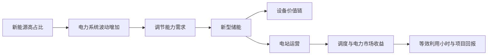

# 中国新型储能行业专家学习报告

> 示例说明：这是一份用于展示 `yao-expert-skill` 输出形态的精简版样例。正式标准版会把关键词扩展到 50-80 个，并按用户目的补充更多公司、人物、机构、案例、数据和来源。

## 导读摘要

### 这份学习材料解决什么问题

这份材料是给第一次系统接触新型储能的人看的。它不假设你已经懂电力系统、锂电池或电力市场，而是先用相对直白的语言说明：储能到底在解决什么问题、行业里有哪些角色、为什么装机规模很重要但又不能只看装机。

读完这份报告，你应该能完成三件事：第一，用几句话向外行解释新型储能为什么存在；第二，看懂电芯、PCS、EMS、独立储能、等效利用小时这些关键词之间的关系；第三，知道继续判断这个行业时应该去验证哪些数据和真实案例。

### 本报告的三个亮点

1. 它先定边界，再看结构，避免把动力电池、抽水蓄能、户外电源和电网侧储能混在一起。
2. 它把关键词做成教学卡，每个词都给出通俗理解、概念阐述、底层逻辑、真实例子和应用场景。
3. 它最后用费曼问题做自测，帮助你判断自己是真的理解了行业，还是只是记住了一批术语。

### 推荐阅读路径

如果你是完全陌生的新手，建议先读“默认假设与研究边界”和“一页专家速览”，先把行业大图放进脑子里。然后读“价值链”和“关键词库”，理解这个行业的语言和角色。如果你是创业、产品或销售视角，可以重点看“竞争结构”“代表锚点”和“机会风险”；如果你要带团队学习，可以直接把“专家学习教程”和“费曼自测”作为内部训练材料。

### 底层逻辑说明

这份报告按“边界 -> 结构 -> 动态 -> 例子 -> 自测”的顺序展开。先定边界，是为了避免研究对象混乱；再看分类和价值链，是为了知道行业由哪些角色组成；接着看市场状态、生命周期和竞争，是为了理解行业为什么正在变化；最后用公司、人物、关键词、教程和自测，把抽象概念转成新人能复述、能讨论、能继续验证的知识。

## 0. 默认假设与研究边界

先说明这份报告默认站在哪个口径上。新型储能这个词本身就容易和动力电池、抽水蓄能、户外电源混用，所以在正式分析之前，需要先把地域、用途、时间范围和排除项讲清楚。这样后面的数据、公司和案例才不会被错误放在一起比较。

| 项目 | 当前设定 | 说明 |
|---|---|---|
| 主题 | 中国新型储能行业 | 以电力系统侧新型储能为主 |
| 地域 | 中国 | 政策、市场机制和电网场景以中国为口径 |
| 用途 | 快速建立专家认知 | 适合团队新人、创业预研、产品和销售理解 |
| 时间范围 | 当前到未来3年 | 覆盖 2025-2027 政策窗口 |
| 深度 | 示例精简版 | 仅展示结构，不追求完整行业穷尽 |
| 排除项 | 抽水蓄能深度研究、海外市场、单家公司财务模型 | 避免范围漂移 |

## 1. 一页专家速览

这一节是整份报告的压缩版。你可以先把它当作行业地图：知道一句话定义、几个核心事实和几个关键判断之后，再进入后面的边界、价值链和关键词学习，会更容易把信息串起来。

### 一句话定义

新型储能是除传统抽水蓄能以外、帮助电力系统在“电多时存起来、电少时放出来”的一组技术和商业安排，核心价值是让新能源、电网调节和电力保供更稳定。

### 五个核心事实

1. `fact`：国家能源局口径下，新型储能不包含传统抽水蓄能，典型作用是在新能源大发或低负荷时充电，在需要时放电。
2. `fact`：截至 2025 年底，全国已建成投运新型储能装机规模达到 1.36 亿千瓦 / 3.51 亿千瓦时，较 2024 年底增长 84%，平均储能时长 2.58 小时。
3. `fact`：截至 2025 年底，锂离子电池储能仍占主导，装机占比为 96.1%；压缩空气、液流电池、飞轮等路线合计占比 3.9%。
4. `fact`：2025 年独立储能新增装机 3543 万千瓦，累计装机占比为 51.2%，说明商业角色正在从“新能源配套”向“独立调节资源”移动。
5. `fact`：国家发展改革委、国家能源局在 2025 年印发《新型储能规模化建设专项行动方案（2025-2027年）》，把规模化建设和高质量发展放到政策主线。

### 五个关键判断

| 判断 | 类型 | 证据 | 置信度 |
|---|---|---|---|
| 新型储能已从示范期进入规模化建设期。 | inference | 2025 年底装机、独立储能占比、2025-2027 专项行动方案 | high |
| 行业最大瓶颈正在从“能不能建”转向“能不能被有效调用并获得稳定收益”。 | inference | 等效利用小时提升、政策强调市场机制和调度运用 | medium |
| 短时锂电仍是主流，但长时储能会成为未来3年的观察重点。 | hypothesis | 4小时及以上项目占比提高，非锂路线仍小但被政策和试点关注 | medium |
| 对创业者而言，纯电芯制造门槛高，系统集成、EMS、运维、安全监测和交易运营更适合寻找细分机会。 | inference | 产业链分工、项目大型化、市场化调用需求 | medium |
| 低价竞争和安全事故是行业认知中不能忽视的两类风险。 | hypothesis | 技术路线集中、规模扩张、监管持续强调安全管理 | medium |

## 2. 领域定义、边界与排除项

理解新型储能，最容易踩的坑是把“所有和电池有关的东西”都放进来。这个行业的关键不是电池本身，而是这些技术如何服务电力系统调节。下面的边界表会帮助你区分宽口径、窄口径和本报告真正采用的数据口径。

| 口径 | 定义 | 包含 | 排除 |
|---|---|---|---|
| 宽口径 | 储能产业生态 | 抽水蓄能、新型储能、设备、系统、运营、电力市场服务 | 与电力调节无关的消费电池 |
| 窄口径 | 新型储能电力应用 | 锂电、液流、压缩空气、飞轮、钠离子、EMS、PCS、BMS、储能电站 | 抽水蓄能深度研究 |
| 数据口径 | 国家能源局新型储能口径 | 除传统抽水蓄能外的储能技术 | 不同咨询机构的口径混用 |
| 排除口径 | 容易误放入的对象 | 动力电池产能、户外电源、消费电子电池 | 与电网侧价值无直接关系的产品 |

## 3. 多口径分类地图

同一个行业，不同人会用不同方式切分。监管部门关心政策和装机，企业关心产品和场景，投资人关心可比公司和商业模式，电网则关心调节能力。把这些口径放在一起看，能避免只用单一分类解释所有问题。

| 分类视角 | 用途 | 典型问题 | 代表依据 |
|---|---|---|---|
| 官方/政策口径 | 看装机、政策、监管 | 什么算新型储能 | 国家能源局、国家发展改革委文件 |
| 技术路线 | 看成熟度和替代风险 | 用什么方式存电 | 锂离子、液流、压缩空气、飞轮等 |
| 应用场景 | 看需求和收益来源 | 谁需要调节能力 | 独立储能、新能源配储、工商业储能、电网侧储能 |
| 价值链角色 | 看企业赚哪段钱 | 谁制造，谁集成，谁运营 | 电芯、PCS、BMS、EMS、系统集成、EPC、运维 |
| 商业模式 | 看现金流 | 靠容量、电量、辅助服务还是价差 | 电力市场、容量补偿、峰谷套利、租赁 |

## 4. 价值链、参与者与利润池

当边界和分类清楚以后，就要看行业里谁在做什么。储能不是一个单点产品，而是一条从电芯、设备、集成、建设到运营和交易的链条。不同环节的能力、收入来源和风险都不一样，所以理解价值链是看懂商业机会的前提。

| 环节/角色 | 核心能力 | 收入或价值来源 | 壁垒 | 观察指标 |
|---|---|---|---|---|
| 电芯与材料 | 电化学体系、制造良率 | 电芯销售 | 规模、成本、质量、安全 | 单 Wh 成本、循环寿命、良率 |
| PCS/BMS/EMS | 电力电子、控制、安全 | 设备和软件销售 | 控制算法、并网适配、可靠性 | 转换效率、故障率、响应速度 |
| 系统集成 | 设备选型、集成交付 | 项目收入 | 交付经验、认证、供应链 | 毛利率、项目周期、验收通过率 |
| EPC/建设 | 工程设计和施工 | 工程服务费 | 资质、工程管理 | 工期、质量、安全记录 |
| 电站运营 | 调度、交易、运维 | 电力市场收益、容量或租赁收益 | 市场理解、数据、运维能力 | 等效利用小时、可用率、收益率 |
| 安全与检测 | 风险监测、认证、消防 | 检测、运维、安全服务 | 标准、资质、公信力 | 热失控预警、事故率、响应时间 |

## 5. 当前状态八维诊断

这一节回答“现在行业处在什么状态”。单看市场规模容易觉得一切都在高速增长，但真实判断还要同时看需求、供给、竞争、政策、技术和收益机制。八个维度放在一起，能让读者看到增长背后的约束。

| 维度 | 当前状态 | 关键证据 | 不确定性 |
|---|---|---|---|
| 市场 | 高速扩张后进入规模化建设 | 2025 年底 1.36 亿千瓦 / 3.51 亿千瓦时 | 不同机构统计口径差异 |
| 需求 | 新能源消纳、电网调峰、保供共同驱动 | 国家能源局发布会说明其支撑新能源消纳和稳定运行 | 各省电力市场收益差异 |
| 供给 | 锂电路线占绝对主导 | 2025 年底锂电占比 96.1% | 价格战对质量和盈利的影响 |
| 竞争 | 产业链长，参与者多，项目大型化 | 10万千瓦以上项目占比达 72% | 头部集中度和地方项目质量 |
| 价值链 | 利润从设备销售逐步向运营、交易、软件和安全服务延伸 | 独立储能占比提升 | 市场机制兑现速度 |
| 政策/标准 | 政策持续推动规模化和高质量 | 2025-2027 专项行动方案 | 地方执行差异 |
| 技术 | 短时锂电成熟，长时路线被关注 | 4小时及以上项目占比达 27.6% | 非锂技术经济性 |
| 资本/财务 | 投资规模大，但收益模型仍需市场化完善 | 2021-2025 期间直接带动投资接近 2000 亿元 | 项目 IRR 与真实调用水平 |

## 6. 生命周期与变化变量

生命周期判断的意义，不是简单说行业处在成长还是成熟，而是帮助我们知道下一步该盯什么。新型储能整体在成长，但短时锂电、长时储能和独立储能的成熟度并不一样，所以这里把细分领域分开看。

| 细分领域 | 阶段判断 | 证据 | 例外/反例 | 未来变量 |
|---|---|---|---|---|
| 电力系统新型储能整体 | 成长期 | 装机快速增长、政策专项行动 | 局部项目收益不稳定 | 市场化调用和收益机制 |
| 锂电短时储能 | 成长期后段 | 技术主流、项目大型化 | 价格战和安全压力 | 成本、质量、安全标准 |
| 长时储能 | 导入到成长早期 | 4小时及以上占比提升 | 非锂路线占比仍低 | 技术成本、示范项目效果 |
| 独立储能 | 成长期 | 累计装机占比 51.2% | 地方市场规则差异 | 电力现货和辅助服务市场 |

## 7. 竞争结构、壁垒与替代风险

看完生命周期之后，还要看行业里的力量如何互相挤压。储能不是只有同行竞争，还会受到替代调节资源、上游电芯、下游电网和工商业客户的影响。理解这些力量，才能判断哪里有壁垒，哪里只是短期热闹。

| 力量 | 当前判断 | 证据 | 对学习/行动的影响 |
|---|---|---|---|
| 现有竞争 | 设备侧竞争强，运营侧能力分化 | 锂电占比高，项目大型化 | 不要只看装机，要看利用和收益 |
| 潜在进入者 | 系统集成和运维进入者较多 | 产业链长、地方项目多 | 需要用资质、案例、数据能力筛选 |
| 替代品 | 抽水蓄能、火电灵活性、需求响应都是替代/互补 | 电力系统调节资源多元 | 新型储能不是唯一调节方式 |
| 供应方 | 电芯和关键设备影响成本与交付 | 锂电路线主导 | 上游价格和质量控制重要 |
| 购买方 | 电网、发电企业、工商业用户议价能力强 | 项目多依赖场景和政策 | 商业模型要从客户收益倒推 |

## 8. 政策、标准、技术与资本信号

新型储能的行业节奏很大程度上受政策、标准、技术路线和市场机制影响。对新人来说，不需要一开始就读完所有政策文件，但要知道哪些信号会改变行业走向，后续跟踪时才有重点。

| 信号类型 | 关键内容 | 为什么重要 | 跟踪方式 |
|---|---|---|---|
| 政策 | 2025-2027 专项行动方案 | 决定规模化建设方向 | 跟踪国家发展改革委、国家能源局 |
| 调度 | 新型储能调用水平提升 | 影响真实收益 | 看等效利用小时和市场规则 |
| 安全 | 电化学储能安全管理持续强化 | 影响准入、保险和运维 | 看事故、标准、检测要求 |
| 技术 | 长时储能占比提升 | 影响技术路线选择 | 看 4小时及以上项目占比 |
| 市场 | 独立储能占比提升 | 影响商业模式 | 看独立储能参与现货、辅助服务 |

## 9. 代表公司、人物、机构、案例或实践场景

抽象概念需要落到真实对象上，才容易被理解。这里选取的公司、人物和角色不是排名，也不是投资建议，而是学习锚点：每个对象都对应一个行业逻辑，帮助你把概念和现实场景连起来。

### 学习锚点：宁德时代 CATL

| 字段 | 内容 |
|---|---|
| 类型 | 典型公司 |
| 代表性原因 | 公开资料显示其业务覆盖动力电池和储能系统。 |
| 它说明的底层逻辑 | 电芯能力和规模制造会影响储能系统成本、安全和供应链。 |
| 新人可学什么 | 看储能不能只看电站，也要看电芯、材料和制造能力。 |
| 不应过度推断 | 不能把电芯龙头的逻辑直接等同于所有储能运营项目的收益逻辑。 |
| 来源 | 宁德时代官网 |

### 学习锚点：比亚迪储能

| 字段 | 内容 |
|---|---|
| 类型 | 典型公司 |
| 代表性原因 | 官网显示其提供源网侧、工商业、微电网等储能解决方案。 |
| 它说明的底层逻辑 | 储能公司不只是卖电池，还会按场景提供系统方案。 |
| 新人可学什么 | 学会按应用场景理解产品，而不是只按电池型号理解。 |
| 不应过度推断 | 官网产品矩阵能说明场景覆盖，但不能单独证明项目经济性。 |
| 来源 | 比亚迪储能官网 |

### 学习锚点：阳光电源 Sungrow

| 字段 | 内容 |
|---|---|
| 类型 | 典型公司 |
| 代表性原因 | 官网显示其储能系统覆盖 PCS、锂电池和 EMS，并服务户用、工商业、公用事业侧。 |
| 它说明的底层逻辑 | 储能系统集成的关键是电力电子、电化学和电网支撑能力的组合。 |
| 新人可学什么 | PCS/EMS 不是配件，而是储能能否并网、调度和赚钱的核心。 |
| 不应过度推断 | 系统集成能力不等于每个市场和每个项目都有同样收益。 |
| 来源 | 阳光电源官网 |

### 学习锚点：南网储能

| 字段 | 内容 |
|---|---|
| 类型 | 典型公司/运营平台 |
| 代表性原因 | 公开资料显示其主营抽水蓄能、调峰水电和电网侧独立储能业务。 |
| 它说明的底层逻辑 | 电站运营能力和电网调度理解决定储能资产能否被有效使用。 |
| 新人可学什么 | 从运营商视角看储能：资产建成只是第一步，被调用才产生价值。 |
| 不应过度推断 | 南网储能的区域和电网侧属性不能代表所有用户侧储能项目。 |
| 来源 | 公司公开资料 |

### 学习锚点：曾毓群 / Robin Zeng

| 字段 | 内容 |
|---|---|
| 类型 | 代表人物 |
| 代表性原因 | 宁德时代官方英文新闻称其为 CATL chairman and CEO。 |
| 它说明的底层逻辑 | 行业人物可以帮助理解技术路线、资本战略和产业组织方式。 |
| 新人可学什么 | 人物不是结论来源，但能帮助新人找到行业叙事和战略变化的入口。 |
| 不应过度推断 | 不能用单个企业家的观点替代行业证据。 |
| 来源 | 宁德时代官网 |

### 学习锚点：电网调度员

| 字段 | 内容 |
|---|---|
| 类型 | 关键角色 |
| 代表性原因 | 储能是否有价值，最终取决于电力系统何时需要它充放电。 |
| 它说明的底层逻辑 | 调度逻辑决定储能从“设备”变成“系统资源”。 |
| 新人可学什么 | 学储能必须理解电网运行，而不是只懂电池参数。 |
| 不应过度推断 | 调度员是理解角色，不是单一商业主体。 |
| 来源 | 国家能源局口径与电力系统常识 |

> 这些对象是学习锚点，不是公司排名，也不是投资建议。

## 10. 关键词库与概念关系图

关键词是进入行业的语言入口，但真正有用的不是背词，而是知道一个词为什么存在、解决什么问题、在哪里出现、会影响什么判断。下面的关键词卡片会用“通俗理解 -> 概念阐述 -> 底层逻辑 -> 真实应用”的方式展开。

### 关键词分组

| 模块 | 关键词 |
|---|---|
| 边界与分类 | 新型储能、抽水蓄能、独立储能、长时储能 |
| 技术与设备 | 电芯、PCS、BMS、EMS、液流电池、压缩空气储能 |
| 商业模式 | 峰谷套利、辅助服务、容量补偿、租赁模式 |
| 运营指标 | 等效利用小时、可用率、循环寿命、LCOS |
| 风险 | 热失控、安全监测、并网验收、价格战 |

### 关键词卡片

#### 关键词：新型储能

| 字段 | 内容 |
|---|---|
| 一句话通俗理解 | 新型储能就是电力系统里的“可调度充电宝”，但它服务的是电网和大型用电场景。 |
| 概念阐述 | 国家能源局口径下，新型储能通常指除传统抽水蓄能以外的新型储能技术，用于充放电和系统调节。 |
| 底层逻辑 | 风电、光伏出力不稳定，电力系统又必须实时平衡，所以需要一种能在电多时吸收、电少时释放的调节资源。 |
| 所属模块 | 边界与分类 |
| 作用 | 决定统计口径、政策适用范围、研究边界和公司筛选范围。 |
| 行业真实示例 | 锂离子电池储能、液流电池、压缩空气储能、飞轮储能。 |
| 应用场景 | 新能源基地配储、电网侧独立储能、工商业削峰填谷、微电网。 |
| 可观察指标 | 装机功率、储能容量、平均储能时长。 |
| 相关概念 | 抽水蓄能、独立储能、长时储能。 |
| 常见误区 | 把所有电池产品都算作新型储能。 |
| 证据 | 国家能源局、国务院英文网。 |

#### 关键词：独立储能

| 字段 | 内容 |
|---|---|
| 一句话通俗理解 | 独立储能不是某个风光项目的“附属电池”，而是可以单独接受调度、参与市场的电站。 |
| 概念阐述 | 独立储能是作为独立主体接入电力系统、参与调峰、辅助服务或电力交易的储能资产。 |
| 底层逻辑 | 如果储能只能跟着某个电源项目使用，价值会被限制；独立出来后，它可以在系统最需要调节能力的地方发挥作用。 |
| 所属模块 | 应用场景 |
| 作用 | 说明储能商业模式从“配套建设”向“独立调节资源和市场化收益”移动。 |
| 行业真实示例 | 参与电力现货、调峰、辅助服务的共享储能或独立储能电站。 |
| 应用场景 | 电网侧调峰、辅助服务、电力现货价差、容量租赁。 |
| 可观察指标 | 累计装机占比、等效利用小时、市场收益。 |
| 相关概念 | 共享储能、电网侧储能、辅助服务。 |
| 常见误区 | 只看装机，不看是否被调用。 |
| 证据 | 国家能源局 2026-01-30 发布会。 |

#### 关键词：PCS

| 字段 | 内容 |
|---|---|
| 一句话通俗理解 | PCS 像储能系统和电网之间的“翻译器”，把电池能用的电变成电网能接收的电。 |
| 概念阐述 | PCS 是储能变流器，负责电池直流电与电网交流电之间的能量转换和控制。 |
| 底层逻辑 | 电池和电网的电气形态不同，储能要并网、响应调度、稳定输出，就必须通过 PCS 做转换和控制。 |
| 所属模块 | 技术与设备 |
| 作用 | 影响并网能力、转换效率、响应速度、系统安全和电网友好性。 |
| 行业真实示例 | 阳光电源等系统厂商在储能系统中把 PCS、锂电池和 EMS 组合成解决方案。 |
| 应用场景 | 公用事业侧储能、工商业储能、构网型储能、微电网。 |
| 可观察指标 | 转换效率、响应时间、故障率。 |
| 相关概念 | BMS、EMS、逆变器。 |
| 常见误区 | 认为储能系统只有电芯重要。 |
| 证据 | 行业设备资料与并网要求。 |

#### 关键词：EMS

| 字段 | 内容 |
|---|---|
| 一句话通俗理解 | EMS 是储能电站的大脑，决定什么时候充电、什么时候放电、怎么参与市场。 |
| 概念阐述 | EMS 是能量管理系统，用于监控、优化和调度储能系统的运行策略。 |
| 底层逻辑 | 储能本身不自动赚钱，只有在正确时间、正确场景执行充放电，才会产生系统价值和经济收益。 |
| 所属模块 | 软件与运营 |
| 作用 | 连接设备运行、电网调度、电价变化和收益优化。 |
| 行业真实示例 | 工商业储能用 EMS 做削峰填谷；独立储能用 EMS 配合调度和交易策略。 |
| 应用场景 | 电站调度优化、工商业能源管理、电力交易辅助、微电网控制。 |
| 可观察指标 | 等效利用小时、收益率、可用率。 |
| 相关概念 | BMS、SCADA、电力交易。 |
| 常见误区 | 把 EMS 当作简单监控后台。 |
| 证据 | 市场化调用和运营需求。 |

#### 关键词：等效利用小时

| 字段 | 内容 |
|---|---|
| 一句话通俗理解 | 等效利用小时告诉你：这个储能电站不是只建在那里，而是真的被用了多久。 |
| 概念阐述 | 等效利用小时是衡量储能资产实际调用程度和运行强度的指标。 |
| 底层逻辑 | 储能是资本密集资产，装机越多不等于价值越大；只有被调用、被结算，才可能形成收益。 |
| 所属模块 | 运营指标 |
| 作用 | 帮助判断电站利用率、收益潜力和调度价值。 |
| 行业真实示例 | 国家能源局披露 2025 年全国新型储能等效利用小时数达 1195 小时。 |
| 应用场景 | 项目投资评估、运营复盘、地方市场规则比较。 |
| 可观察指标 | 年等效利用小时、充放电次数。 |
| 相关概念 | 可用率、循环次数、收益率。 |
| 常见误区 | 装得多就等于用得好。 |
| 证据 | 国家能源局 2026-01-30 发布会。 |

#### 关键词：长时储能

| 字段 | 内容 |
|---|---|
| 一句话通俗理解 | 长时储能像更大容量、更能扛时间的“电力缓冲垫”，用来处理更长周期的供需错配。 |
| 概念阐述 | 长时储能通常指持续放电时间更长、服务更长周期电力平衡的储能方案。 |
| 底层逻辑 | 当新能源占比越来越高，系统不仅需要分钟级和小时级调节，也需要跨更长时段的能量搬移能力。 |
| 所属模块 | 技术趋势 |
| 作用 | 影响技术路线选择、电网调节能力规划和未来投资方向。 |
| 行业真实示例 | 4小时及以上储能项目、液流电池、压缩空气储能。 |
| 应用场景 | 新能源基地、弱电网区域、长周期调峰、容量资源补充。 |
| 可观察指标 | 4小时及以上项目占比、单位容量成本、效率。 |
| 相关概念 | 短时储能、调峰、容量资源。 |
| 常见误区 | 认为长时储能会立刻替代锂电短时储能。 |
| 证据 | 国家能源局 2025 年底 4小时及以上项目占比数据。 |

### 概念关系图

## 11. 专家学习教程

前面是研究报告式的展开，这一节把它改写成学习路径。你可以按模块逐步学习，也可以把它当成团队新人培训的大纲：每一行都对应一个学习目标、核心概念、练习和检查标准。

| 模块 | 学习目标 | 核心概念 | 通俗示例与练习 | 成功检查 |
|---|---|---|---|---|
| 1. 定义与边界 | 知道新型储能是什么 | 新型储能、抽水蓄能、应用场景 | 把新型储能理解成电网级“充电宝”，但要补充它需要调度和并网规则；练习：用3句话解释新型储能。 | 不把动力电池和储能电站混为一谈 |
| 2. 价值链 | 看懂谁参与、谁赚钱 | 电芯、PCS、BMS、EMS、集成、运营 | 宁德时代更偏电芯和系统能力，阳光电源更能说明 PCS/系统集成逻辑；练习：画一张从电芯到电站收益的链条。 | 能说出至少5类企业角色 |
| 3. 技术路线 | 理解主流和替代 | 锂电、液流、压缩空气、长时储能 | 锂电像成熟主力车型，液流/压缩空气像特定长途场景的候选方案；练习：比较锂电和液流适合的场景。 | 能解释为什么锂电主导但长时储能值得看 |
| 4. 商业模式 | 理解收益来自哪里 | 峰谷套利、辅助服务、容量补偿 | 独立储能像“电网调节服务商”，不是只卖设备；练习：分析一个独立储能项目的收入来源。 | 不只看装机规模 |
| 5. 风险判断 | 识别行业不确定性 | 安全、利用小时、价格战、市场机制 | 等效利用小时像出租车的载客时长，车买了不跑就没有收入；练习：列出3个投资或创业风险。 | 每个风险能给出观察指标 |

## 12. 费曼问题、参考答案与评分

如果一个概念不能用自己的话讲出来，通常说明还没有真正理解。下面的问题不是为了考试，而是为了暴露理解断点。回答时尽量少堆术语，多用例子、因果关系和反例。

| 题号 | 问题 | 参考答案要点 | 评分标准 |
|---:|---|---|---|
| 1 | 用3句话解释新型储能行业。 | 除抽水蓄能外的储能技术；服务电力系统调节；价值来自新能源消纳、保供和市场收益。 | 0-5 |
| 2 | 新型储能和动力电池行业有什么不同。 | 应用对象、客户、评价指标、商业模式不同。 | 0-5 |
| 3 | 画出储能价值链。 | 电芯/设备、系统集成、建设、并网、运营、交易、运维。 | 0-5 |
| 4 | 为什么独立储能重要。 | 它把储能从配套资产变成可被调度和交易的独立资源。 | 0-5 |
| 5 | 行业处在什么生命周期阶段。 | 整体成长期；短时锂电成熟度更高；长时储能偏早期。 | 0-5 |
| 6 | 利润或价值可能集中在哪里。 | 设备规模化、软件调度、交易运营、安全运维、项目开发。 | 0-5 |
| 7 | 进入这个行业最难的3件事是什么。 | 安全可靠性、项目资源和资质、电力市场收益理解。 | 0-5 |
| 8 | 如果创业，你会选哪个切入点。 | 示例：EMS/交易运营、安全监测、工商业储能运维；理由需匹配能力和客户。 | 0-5 |
| 9 | 未来3年最大变量是什么。 | 市场化调用和收益机制；跟踪利用小时、地方规则、辅助服务收益。 | 0-5 |
| 10 | 用外行类比解释。 | 储能像电网的“充电宝”，但比充电宝复杂，因为它要服从调度、安全和市场规则。 | 0-5 |

## 13. 机会、风险与验证清单

理解行业以后，需要把学习转成下一步行动。这里把机会、风险和待验证问题放在一起，是为了提醒读者：有些判断可以作为方向，有些判断必须先找到项目、价格、规则或客户证据。

| 类型 | 内容 | 优先级 | 下一步验证 |
|---|---|---|---|
| 机会 | EMS、交易运营、安全监测、运维服务 | 高 | 找3个省份比较电力市场规则 |
| 机会 | 工商业储能的场景化方案 | 中 | 核算峰谷价差和用户负荷曲线 |
| 风险 | 只看装机，不看调用 | 高 | 跟踪等效利用小时和收益结算 |
| 风险 | 价格战压低设备质量 | 中 | 看质保、事故、验收和退役数据 |
| 待验证 | 长时储能经济性 | 高 | 比较 4小时以上项目的成本和应用场景 |

## 14. 不确定性日志

行业研究里有些问题暂时无法给出确定答案。与其假装确定，不如把不确定性单独列出来，说明为什么不确定、缺什么证据、下一步应该怎么验证。

| 问题 | 为什么不确定 | 需要什么证据 | 建议验证方法 |
|---|---|---|---|
| 独立储能项目真实收益率 | 地方市场规则和调用频率差异大 | 项目收益结算、辅助服务价格 | 做省份案例拆解 |
| 长时储能商业化速度 | 技术路线和成本仍在变化 | 示范项目运行数据 | 跟踪 4小时以上项目招标和运行 |
| 设备价格战对安全的影响 | 公开事故和质量数据有限 | 事故、召回、验收失败数据 | 结合监管通报和保险数据 |

## 15. 参考资料

参考资料不是装饰，它决定了报告里哪些内容更可信。这里把主要来源放在最后，方便读者继续追溯原始材料，也方便检查关键判断的证据基础。

| 来源 | 发布方 | 日期 | 用途 | 置信度 |
|---|---|---|---|---|
| [国家能源局举行新闻发布会介绍2025年新型储能发展情况](https://www.nea.gov.cn/20260130/50f657ce87f848e1a9a1861d1fd9aa23/c.html) | 国家能源局 | 2026-01-30 | 2025 年装机、技术占比、场景、利用小时 | high |
| [China's new energy storage capacity exceeds 70 million KW](https://english.www.gov.cn/archive/statistics/202501/24/content_WS6793830cc6d0868f4e8ef23f.html) | 中国政府网英文版 | 2025-01-24 | 新型储能定义、2024 年装机与投资信号 | high |
| [《新型储能规模化建设专项行动方案（2025—2027年）》通知](https://app.www.gov.cn/govdata/gov/202509/12/536503/article.html) | 国家发展改革委、国家能源局 | 2025-09-12 | 政策方向和 2025-2027 窗口 | high |
| [中国新型储能发展报告2025](https://www.nea.gov.cn/20250731/1d40d09f75714280a9218d5bea178fbd/202507311d40d09f75714280a9218d5bea178fbd_453d9a0609da1d4456a8b12d843bd256cf.pdf) | 国家能源局能源节约和科技装备司、电力规划设计总院 | 2025-07-31 | 政策脉络、标准、安全和技术路线 | high |
| [宁德时代企业简介](https://www.catl.com/about/profile/) | 宁德时代 | 访问日期 2026-06-03 | 典型公司和储能系统业务锚点 | medium |
| [比亚迪储能官网](https://www.bydenergy.com/index/) | 比亚迪储能 | 访问日期 2026-06-03 | 源网侧、工商业、微电网等场景锚点 | medium |
| [Sungrow Energy Storage System](https://www.sungrowpower.com/en/ess) | 阳光电源 Sungrow | 访问日期 2026-06-03 | PCS、锂电池、EMS 和系统集成锚点 | medium |
| [南方电网储能股份有限公司官网](https://www.es.csg.cn/) | 南网储能 | 访问日期 2026-06-03 | 电站运营平台锚点 | medium |
| [CATL: Robin Zeng at World Economic Forum](https://www.catl.com/en/news/6202.html) | 宁德时代 | 2024-01 | 代表人物锚点 | medium |
